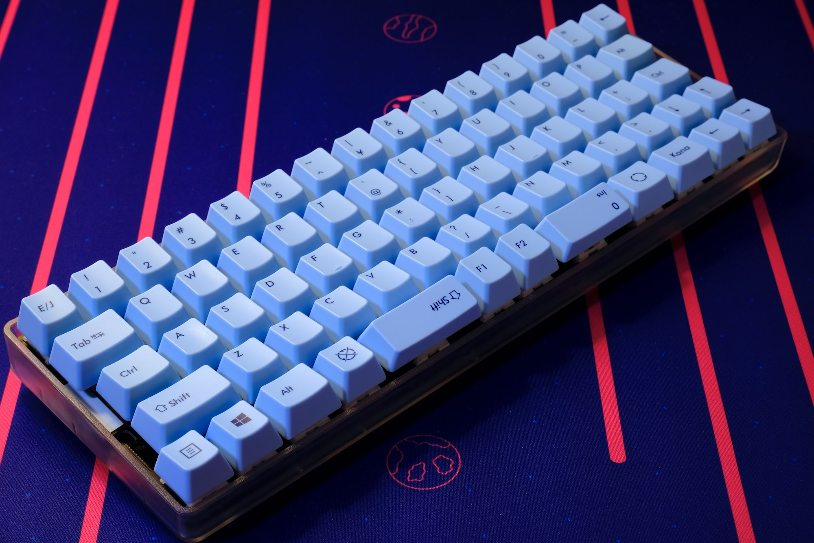
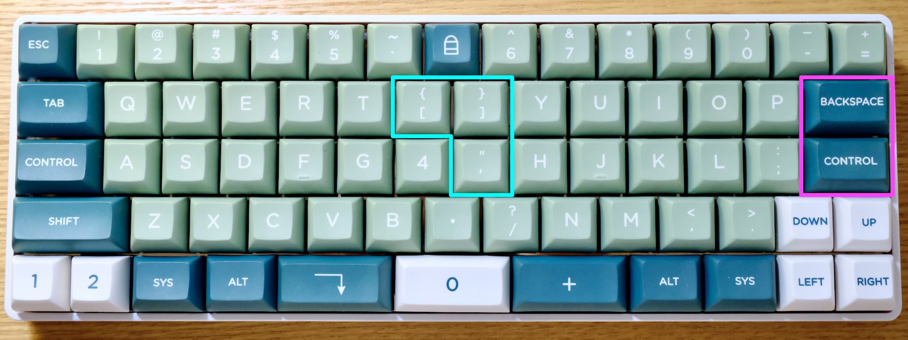
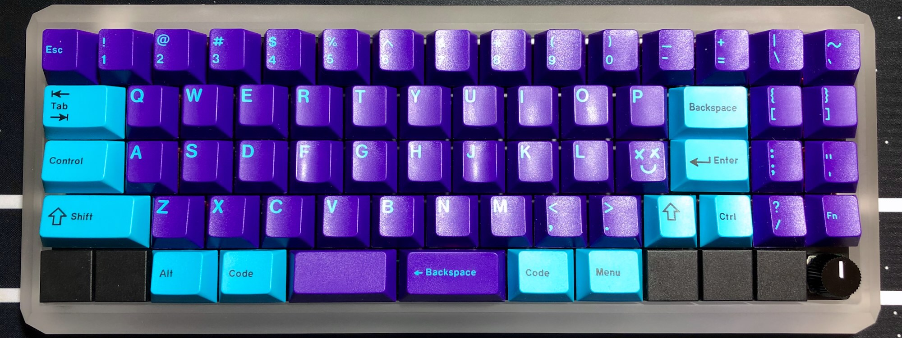
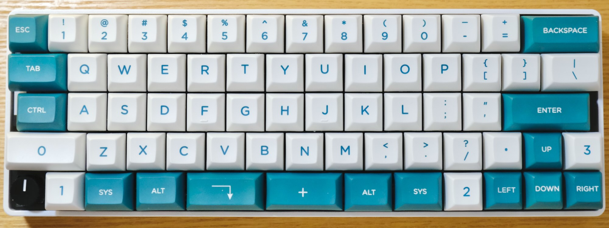

# Jones（ジョーンズ）とは



Jones（ジョーンズ）は、2行目と3行目にずれのない、ロースタッガードとオルソリニアを組み合わせた60%キーボードです。  
左右対象のアルファ部と、右手側Modキーをホームポジションのすぐ隣へ配置したレイアウトが特徴です。  

40%や50%キーボードのコンパクトで軽快な運指の心地良さと、レイヤーに数字や記号を押し込まなくてよい十分なキー数を兼ね備えています。

GH60型やPoker型に互換性のあるケースや、専用のボトムプレートと組み合わせて使用できます。

名前の由来は、ロースタガとオルソリニアをつなぐ”橋”という意味を込めて…

``` text
橋（ブリッジ）　→　ブリッジド　→　ブリジット　→　ブリジット・ジョーンズ　→　ジョーンズ

Bridge --> Bridged --> Bridget --> Bridget Jones --> Jones
```

という具合の言葉遊びで、ジョーンズ（Jones）に決まりました。

---

Jones is a 60% keyboard combined with Ortho-linear and Row-staggered. It has gapless R2-R3 row.  
Symmetrical alpha-keys and nearby right side mod-keys provide natural typing position.  

It has compact and light fingering which like 40% and 50% keyboards.
And also, it has enough keys, no need to push numeric and symbol keys into layers.

It can be used with GH60 and Poker compatible cases.

## 対象とするユーザー

Jonesキーボードは、  
*一般的なキーボードのキー配列に不満があり、より良いタイピングポジションを求めている方*  
を対象に作られています。

次のような方におすすめします。

- より良いタイピングポジションを求めている方  
  左右対称のレイアウトと右手側Modキーの配置変更によって、より良いポジションで打鍵することができます。  
  Z~Bを左へずらした完全に左右対称なレイアウトにすれば、さらにポジションを改善できます。

- 機能的なキー配列を求めている方  
  あまり使わないキーをホームポジションから外し、よく使うキーを使いやすい位置に配置しています。  
  分割したスペースキーや親指付近のキーにEnterやBackspaceを割り当てて、これまでとは違う使い方も楽しめます。

- レイアウトを変えるのが不安な方，指使いを変えたくない方  
  左右対称のレイアウトに戸惑うかもしれませんが、一般的なキーボードの違いはごくわずかです。  
  3行目から下が左へ1/4キー（0.25u）ずれただけなので、ほぼ同じレイアウトで使用できます。  
  指使いを覚え直す必要がなく、これまでどおりの指使いのまま打鍵することができます。

- キーの数を減らしたくない方  
  数字行，記号，カーソルなど、よく使うキーは盤面上に配置されています。  
  テンキーやファンクションキーは、レイヤーを切り替えたり、他のキーと組み合わせたりして使用できます。

参考までに、*冗談半分で*以下のチャートにまとめました。

<!--　チャート更新 -->


## コンセプト

このキーボードのコンセプトや実現したい要件は次の通りです。

- 基本的には、一般的なキーボードのロースタガレイアウトでそこそこ満足という気持ち。
- 左手の肘、手首、指先を直線状に並べて、ポジションを改善したい。  
  一般的なロースタガでは左手首の角度がおかしい。
- 右手のModが遠いと打鍵がつらくなるのを改善する。
- アルファ部が左右対称じゃないと話にならない。
- サイズは60%。  
  レイヤーに数字や記号を押し込まなくてもよいキー数と、筐体サイズのコンパクトさのバランス。
- GH60型のケースに対応させ、ケース設計をメイン作業に含めない。
  キーレイアウトを提案したい。
- HHKB的な何かを目指しつつ、スプリットスペースが使いたい。
- たまに一般的なキーボードを使うときにも、戸惑うことなく使えるようなレイアウトにとどめておく。
- 標準的なキーキャプですべて埋められるレイアウトを用意する。

## 特徴

### キーレイアウト

#### 独自のずれ幅をもつ左右対象のアルファ部

2行目と3行目にずれの無い、ロースタッガードとオルソリニアを組み合わせたキー配列です。  
分類上は、シンメトリカル、左右対称ロースタッガードや変則ロースタッガードと呼んでも良いかもしれません。  

左手と右手が同じずれ幅となる左右対象のアルファ部により、肘、手首、指先が直線上に並んだ自然なポジションにします。  

  
Jones, Wideレイアウト: 左手、右手ともに、肘、手首、指先が直線上に並ぶ

  
一般的なレイアウト: 左手の手首から先、指先が外側へ向く

#### 右手のホームポジションに近づけたModキー

40%や50%キーボードのコンパクトなレイアウトにならい、Modキーを右手のホームポジションのすぐ隣に配置しました。  
打鍵しやすい位置に使用頻度の高いキーを配置したことで、右手の負担を軽減できます。  

使用頻度の低い記号キーは、Wideレイアウトではキーボードの中央へ、Narrowレイアウトでは右端へ移動しています。

  
右手のホームポジションすぐ隣のModキーと、移動した記号キー（Wideレイアウト）

  
右手のホームポジションすぐ隣のModキーと、移動した記号キー（Narrowレイアウト）

#### キーレイアウトのバリエーション

キーレイアウトは、Wide（ワイド），Narrow（ナロー），Normal（ノーマル）の、3つのバリエーションがあります。  
最下行はスペースキーとModキーの組み合わせが選択でき、左右の端はロータリーエンコーダにすることもできます。

- Wide（ワイド）レイアウト  
  右手ホームポジションを右側へずらしてModキーに近づけ、キーボード中央に2キー分の間隔をもたせたレイアウトです。  
  キーボード全体を左右対称にすることができます。  
  左手と右手のホームポジションが離れるため、肩への負担を軽減できます。
    

- Narrow（ナロー）レイアウト  
  右側Modキーをキーボード中央側へずらし、ホームポジションに近づけたレイアウトです。  
  40%キーボードに、上へ1行、右に2列増やしたようなレイアウトになっています。  
  アルファ部とModを左右対称にしつつ、右端2列の非シンメトリカルな存在を楽しむことができます。  
  カスタムキーキャップを使って構成します。
    

- Normal（ノーマル）レイアウト  
  一般的な英語配列や日本語配列とほぼ同じになるように調整したレイアウトです。  
  WideやNarrowレイアウトへの移行（習得）に不安のある方や、一般的なキーボードに近いレイアウトでアルファ部を左右対称にしたい方におすすめです。
    

いずれのレイアウトも、一般的な日本語108キーや英語104キーのキーキャップセットで組み立てることができます。  
Narrowレイアウトを隙間なく構成する場合は、カスタムキーキャップを使用します。

すべてのレイアウトは、[Keyboard Layout Editor: Jones v.1(042)](http://www.keyboard-layout-editor.com/#/gists/53fab8cd4a4480980921f37c39e1f5f3)で確認できます。

### 機能

#### RemapやVIAなどのキーマップ書き換えツールに対応

[Remap](https://remap-keys.app)や[VIA](https://caniusevia.com)などのキーマップ書き換えツールに対応しており、ファームウェアを書き換えることなく、手軽にキーとロータリーエンコーダの割り当てを変更することができます。  

Remapにはキーボード定義を登録済みですので、サイトへアクセスしてキーボードを接続すれば、すぐにキーの割り当てを変更することができます。  
VIAを使用する場合は、以下のキーボード定義ファイルを読み込ませてください。  
キーボード定義ファイル：[jones_v1(042).json](https://gist.github.com/jpskenn/b0e62ff02264ebc955b5153c9b64200d)

#### より多くのレイヤーを使用可能（外部EEPROMの搭載）

外部EEPROMの搭載により、RemapやVIAでより多くのレイヤーを使用することができます。

出荷時に書き込まれているファームウェアでは、6レイヤーまで使用可能です。  
使わない機能を無効化したファームウェアを用意すれば、さらに多くのレイヤーを使用できます。  
（例：スピーカーの機能を無効化した場合、10を超えるレイヤーを使用可能）

#### レイヤーインジケータLED（オプション）

レイヤーの状態を表示するインジケータLEDを、右側または左側に2個、もしくは左右両方に4個設置できます。

基板上にはLEDの信号ピンを用意してあるので、DIYでアンダーグローLEDを追加することもできます。

#### ロータリーエンコーダ（オプション）

ロータリーエンコーダを、最下行の左端または右端に1個、もしくは左右両端に2個設置することができ、OSのボリューム操作やマウスホイールの上下などの機能を割り当てて使用ます。  

#### スピーカー（オプション）

キーボードの起動音やキー入力のクリック音を再生できるスピーカーを設置できます。

#### ケース

GH60型やPoker型に互換性のあるケースに対応しています。

<details>
<summary>取り付け確認済みのケース（2021年7月1日現在）</summary>

- [KBDfans TOFU 60% Aluminum Case](https://kbdfans.com/products/kbdfans-tofu-60-aluminum-case)  

- [KBDfans 5° FROSTED ACRYLIC CNC 60% CASE](https://kbdfans.com/products/pre-order-kbdfans5-transparent-acrylic-cnc-60-case)  

- [60% プラスチックケース](https://yushakobo.jp/shop/60-plastic-case/)（※ケースの一部加工が必要）

また、ケースを使用する代わりに、”Jones用ボトムプレートキット”を使用すれば、ケースレスのサンドイッチマウントとして使用できます。  
ケースを使用する場合に比べてキーボードの高さを低く抑えることができるため、手首の負担軽減などに有効です。  

</details>

## ビルドガイド

- [v.1](./docs/BuildGuide_v.1_JA.md)

<details>
<summary>以前のビルドガイド</summary>

- [v.0.4.1](./docs/BuildGuide_v.0.4.1_JA.md)
- [v.0.3.1 / v.0.3.2](./docs/BuildGuide_v.0.3.1_JA.md)
- [v.0.3](./docs/BuildGuide_v.0.3_JA.md)
- [v.0.2](./docs/BuildGuide_v.0.2_JA.md)
- [v.0.1](./docs/BuildGuide_v.0.1_JA.md)

</details>

## ビルド例

<!--
〓
NormalのUS, JP
その他、レイアウトのところに載せてないもの（v04で実現可能なものに限る）
ZincやKatana風の、Zがそとにくるものも見たい
完全シンメトリカル
GodSpeedで数字行をノベルティ
-->

| ビルド例 | 詳細 |
| --- | :-- |
| [](./assets/_DSF0088.jpeg) | Wide 英語配列, カスタムキーキャップ<br>case: TOFU Aluminum, Black<br>keycaps: KAT Lucky Jade, SP DSA 2x2 (Block) Key, SP G20, SP Blocker<br>rotaly encoder: EC12E24204A2, K-2605 |
| [](./assets/_DSF0406.jpeg)| Wide 英語配列, 英語104キーキャップ<br>case: TOFU Aluminum, Black<br>keycaps: Qisan PBT Keycaps 108, SP Blocker |
| [](./assets/IMG_2798.jpeg) | Narrow 英語配列, カスタムキーキャップ<br>case: 5° Frosted Acrylic CNC 60%<br>keycaps: GMK Pulse, GMK Mitolet, SP Blocker<br>rotaly encoder: EC12E24204A2, K-2605 |

Twitterのハッシュタグ[#Jones_kbd](https://twitter.com/search?q=%23Jones_kbd&f=live)にも、作例が集まっています。

## 私の使用環境

私は、このJonesキーボードを、自宅と会社で2台使用しています。  
2020年7月から試作段階のものを使い始め、多少の変更はあるものの、2行目と3行目にずれのないレイアウトをメインキーボードとして使い続けています。

試作の初期段階から1年近くNarrowレイアウトで使ってきましたが、現在（2021年7月）は親指を活用できるWideレイアウトをUS配列で使っています。

私がどのようにJonesキーボードを使っているのかを共有することで、このキーボードがどういうものなのかを、少しでも共有できたらと思います。

<details>
<summary>私の使用環境</summary>

### 自宅における私的使用

  

自宅ではMacを使用しており、主な用途は次のとおりです。

- キーボードファームウェアの作成。C言語など。（VS Code）
- 各種ドキュメント執筆。Markdown。（VS Code）
- 回路・基板の設計（KiCad）
- グラフィックソフトウェアを用いた、ケースやプレートの設計（Affinity Designerなど）
- 写真編集

カーソルキーが単独で存在しなくても問題ないため、レイアウトから外しています。

私は肘から少し先までを机に乗せて、手をあまり浮かせずに打鍵するタイプなので、小指の付け根付近が最下行のキーに当たりやすく、誤打鍵はしないものの、少し不快に感じます。  
そのため、最下行の左右端から2キーは[Pimpmykeyboard: Switch Blocker](https://pimpmykeyboard.com/switch-blocker-pack-of-10/)を使ってブロッカーにしています。  
プログラムの動作や文章の表現を考えながらキーボードを使うときは、このちょっとした心地よさが大切な気がします。

左手でマウスを使用するため、マウス主体のアプリケーションを使用する際に右手でModキーが操作できるよう、右手側のModキー（Cmd, Opt, Shift, Ctrl）をそれぞれ単独で配置しています。

日本語入力で長音（伸ばし棒）`ー`を使用することが多いため、`L`の隣の`;`には、`-`を割り当てています。  
また、ホームポジションから手を移動するのが面倒だったため、`[`,`]`,`;`,`'`の記号キーは物理的な配置はおこなわず、レイヤー内に配置しました。

左下のロータリエンコーダは、YouTubeの視聴中やradikoの聴取中に、ささっとボリュームを変えるのに使っています。

### 会社における業務使用

  

Windows XPのPCで、主な使用用途は次のとおりです。

- 何らかのデータの集計やリストの管理など（Excel）
- 作業効率化ツールの作成、保守（Excelマクロ（VBA））
- 数値データの大量入力（独自ソフト）
- 掲示物の作成（Word, Excel）

作業量的には、Excel関連が7割、数値データの入力が2割、その他が1割という割合です。  

基本的には自宅で使用しているものと同じですが、独自ソフトでカーソルキーを使うことが多いので、カーソルキーを単独で配置している点が自宅との大きな違いです。  
また、Windows PCのため、Windows向けのベースレイヤーに切り替えています。

数値データの大量入力は、専用のNumericレイヤーでおこなっており、以前Realforceを使っていたときと変わらない速度で入力できています。  

共用PCで作業することが日に何度もあり、そのときは一般的なキーボードを打鍵することになりますが、Jonesのレイアウトが特殊すぎない範囲に収まっているので、特に違和感なく打鍵できています。

余談ですが、緑色や水色などの色付きキーキャップを使用すると、キーボードについて声をかけられる率が上がります。  
ピンク系のキーキャップは、さらにたくさん声をかけられます。

</details>

## 試作歴

これまでの試作の記録は、[試作歴](./docs/Trials.md)にまとめています。

## ロゴ


