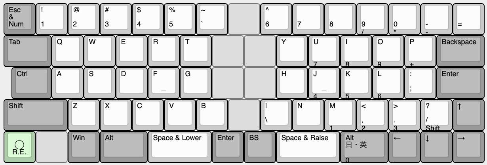

# Jones（ジョーンズ）とは

〓ロゴいれる

<!--〓2uに写真更新-->

Jones（ジョーンズ）は、2行目と3行目にずれのない、ロースタッガードとオルソリニアを組み合わせた60%キーボードです。  
左右対象のアルファ部と、右手側Modキーをホームポジションのすぐ隣へ配置したレイアウトが特徴です。  

40%や50%キーボードのコンパクトで軽快な運指の心地良さと、レイヤーに数字や記号を押し込まなくてよい十分なキー数を兼ね備えています。

GH60型やPoker型に互換性のあるケースと組み合わせて使用できます。

名前の由来は、ロースタガとオルソリニアをつなぐ”橋”という意味を込めて…

    橋　→　ブリッジ　→　ブリッジド　→　ブリジット　→　ブリジット・ジョーンズ　→　ジョーンズ

    Bridge --> Bridged --> Bridget --> Bridget Jones --> Jones

という具合の言葉遊びで、ジョーンズ（Jones）に決まりました。

---

Jones is a 60% keyboard combined with Ortho-Linear and Row-staggered. It has gapless R2-R3 row.  
Symmetrical alpha-keys and nearby right side mod-keys provide natural typing position.  

It has compact and light fingering which like 40% and 50% keyboards.
And also, it has enough keys, no need to push numeric and symbol keys into layers.

It can be used with GH60 or Poker compatible cases.

## 対象とするユーザー

Jonesキーボードは、一般的なキーボードのキー配列に不満があり、より良いタイピングポジションを求めている方を対象に作られています。

また、基本的な組み立て難易度がそれほど高くなく、ファームウェアを書き込む手間もないため、自作キーボードに不慣れな方にもおすすめです。

参考までに、冗談半分で以下のチャートにまとめました。

どうやってもJonesになるチャート

## コンセプト

このキーボードのコンセプトや実現したい要件は次の通りです。

- 基本的には、一般的なキーボードのロースタガレイアウトでそこそこ満足という気持ち。
- 左手の肘、手首、指先を直線状に並べて、ポジションを改善したい。
  一般的なロースタガでは左手首の角度がおかしい。
- 右手のModが遠いとつらいのを改善する。
- アルファ部が左右対称じゃないと話にならない。
- サイズは60%。
  レイヤーに数字や記号を押し込まなくてもよいキー数と、筐体サイズのコンパクトさのバランス。
- GH60型のケースに対応させ、ケース設計をメイン作業に含めない。
  キーレイアウトを提案したい。
- HHKB的な何かを目指しつつ、スプリットスペースが使いたい。
- たまに一般的なキーボードを使うときにも、戸惑うことなく使えるようなレイアウトにとどめておく。
- 標準的なキーキャプですべて埋められるレイアウト。

## 特徴

### キーレイアウト

#### 独自のずれ幅をもつ左右対象のアルファ部

2行目と3行目にずれの無い、ロースタッガードとオルソリニアを組み合わせたキー配列です。  
分類上は、左右対称ロースタッガードや変則ロースタッガードと呼んでも良いかもしれません。  
左手と右手が同じずれ幅となる左右対象のアルファ部により、肘、手首、指先が直線上に並んだ自然なポジションにします。  

〓v04な配列の写真に変更〓
  
Jonesレイアウト: 左手、右手ともに、肘、手首、指先が直線上に並ぶ

  
一般的なレイアウト: 左手の手首から先、指先が外側へ向く

#### 右手のホームポジションに近づけたModキー

40%や50%キーボードのコンパクトなレイアウトにならい、Modキーを右手のホームポジションのすぐ隣に配置しました。  
打鍵しやすい位置に使用頻度の高いキーを配置したことで、右手の負担を軽減できます。  

〓写真：WideとNarrowのModの近さを見せる〓
  
右手のホームポジションすぐ隣のModキー

#### キーレイアウトのバリエーション

Wide（ワイド）レイアウトと、Narrow（ナロー）レイアウトを選べます。  
また、Wideレイアウトのキー配列を一部調整したNormal（ノーマル）レイアウトでは、一般的な英語配列や日本語配列として使うこともできます。  

- Wide（ワイド）レイアウト
  右手ホームポジションを右側へずらしてModキーに近づけ、キーボード中央に2キー分の間隔をもたせたレイアウトです。  
  キーボード全体を左右対称にすることができます。  
  左右のホームポジションが離れるため、肩への負担を軽減できます。
  〓写真Wide〓

- Narrow（ナロー）レイアウト
  右側Modキーをキーボード中央側へずらし、ホームポジションに近づけたレイアウトです。  
  40%キーボードに、上へ1行、右に2列増やしたようなレイアウトになっています。  
  アルファ部とModを左右対称にしつつ、右端2列の非シンメトリカルな存在を楽しむことができます。
  〓写真、Narrow、右2列を記号ではなく、移動やノベルティーにしたもの〓

- Normal（ノーマル）レイアウト
  Wideレイアウトのキーマップを一部調整し、一般的な英語配列や日本語配列のキーボードとして使えるようにしたレイアウトです。  
  WideやNarrowレイアウトへの移行（習得）に不安のある方や、一般的なキーボードの配列でアルファ部を左右対称にしたい方におすすめです。
  〓写真、Wide-NormalでJP配列

WideレイアウトとNormalレイアウトは、一般的な英語104キーや日本語108キーのキーキャップセットで構成することができます。  
カスタムキーキャップを使えば、構成できるレイアウトのバリエーションが広がります。

最下行はスペースキーとModキーのサイズによっていくつかバリエーションがあり、左右の端はロータリーエンコーダにすることもできます。

すべてのレイアウトは  
[Keyboard Layout Editor: Jones v04_1](http://www.keyboard-layout-editor.com/#/gists/5c8ac0bbee831ac1463e579fabf9d351)  
で確認できます。

### 機能

#### RemapやVIAなどのキーマップ書き換えツールに対応

[Remap](https://remap-keys.app)や[VIA](https://caniusevia.com)とったキーマップ書き換えツールに対応しており、ファームウェアを書き換えることなく、手軽にキーの割り当てを変更することができます。  
同様に、ロータリーエンコーダの動作も、RamapやVIAを使って変更することができます。

また、外部EEPROMの搭載により、より多くのレイヤーを使用することができます。

Remapにはキーボード定義を登録済みですので、サイトへアクセスしてキーボードを接続すれば、すぐにキーの割り当てを変更することができます。  
VIAを使用する場合は、以下のキーボード定義ファイルを読み込ませてください。
キーボード定義ファイル：[jones.json](./VIA/jones.json)

#### レイヤーインジケータLED

レイヤーの状態を表示するインジケータLEDを、右側または左側に2個、もしくは左右両方に4個設置できます。

基板上にはLEDの信号ピンを用意してあるので、DIYでアンダーグローLEDを追加することもできます。

#### ロータリーエンコーダ

最下行左端と右端の、片方または両方にロータリーエンコーダを設置することができます。  

OSのボリューム操作やマウスホイールの上下など、各種キーマクロを割り当てて使用することができます。

#### スピーカー

キーボードの起動音やキー入力のクリック音を再生できるスピーカーを設置できます。

[QMKの音楽モード](https://docs.qmk.fm/#/ja/feature_audio?id=音楽モード)を使って曲を演奏することもできます。

#### ケース

GH60型やPoker型に互換性のあるケースに対応しています。

取り付け確認済みのケースは次の通りです。（2021年7月1日現在）

- [KBDfans TOFU 60% Aluminum Case](https://kbdfans.com/products/kbdfans-tofu-60-aluminum-case)  

- [KBDfans 5° FROSTED ACRYLIC CNC 60% CASE](https://kbdfans.com/products/pre-order-kbdfans5-transparent-acrylic-cnc-60-case)  

- [60% プラスチックケース](https://yushakobo.jp/shop/60-plastic-case/)（※ケースの一部加工が必要）

また、ケースを使用する代わりに、”Jonesボトムプレートキット”を使用すれば、ケースレスのサンドイッチマウントとして使用できます。  
ケースを使用する場合に比べてキーボードの高さを低く抑えることができるため、手首などの負担軽減に有効です。  

## ビルドガイド

- [v.0.4.x](./docs/BuildGuide_v.0.4_JA.md)

試作機のビルドガイドは、[試作歴](./docs/trials.md)を参照してください。

## 作例みたいなもの

Wideで中央にブロッカーとか2x2キーとか
NormalのUS
その他、レイアウトのところに載せてないもの（v04で実現可能なものに限る）
ケース、キーキャップをキャプションをつける

## 私の使用環境

私は、このJonesキーボードを、自宅と会社で2台使用しています。  
2020年7月から試作段階のものを使い始め、多少の変更はあるものの、2行目と3行目にずれのないレイアウトをメインキーボードとして使い続けています。

長らくNarrowレイアウトで使っていましたが、現在（2021年7月）はWideレイアウトをUS配列で使っており、親指をもっと活用できるように訓練中です。

〓写真、現在のレイアウト

なお、私はもともと右利きですが、左手でマウスやトラックパッドを使用しています。  
フルキーボードを使用中にカーソルとテンキーを超えて右手をマウスに移動するのは非効率だと思い、20年以上前にマウスを左手に持ち替えました。  
（スキーで転倒して右肩脱臼でマウスが持てなかったからとか、左手をたくさん使って右脳を活性化させて奇抜なアイデアを生み出そうとたくらんでいるとか、そういう理由もあります）  
60%以下のキーボードを使う分には、恩恵はあまりないのですが、今のところは左手のままです。

### 自宅における私的使用

  

自宅ではMacを使用しており、主な用途は次のとおりです。

- キーボードファームウェアの作成。C言語など。（VS Code）
- 各種ドキュメント執筆。Markdown。（VS Code）
- 回路・基板の設計（KiCad）
- グラフィックソフトウェアを用いた、ケースやプレートの設計（Affinity Designerなど）

これらの用途ではカーソルキーが単独で存在しなくても問題ないため、レイアウトから外しています。

私は手を机から浮かせず（手首付近まで前腕を机に乗せている）に打鍵するタイプなので、小指の付け根付近が最下行のキーに当たりやすく、誤打鍵はしないものの、少し不快に感じます。  
そのため、最下行の左右端から2キーは[Pimpmykeyboard: Switch Blocker](https://pimpmykeyboard.com/switch-blocker-pack-of-10/)を使ってブロッカーにしています。  
プログラムの動作や文章の表現を考えながらキーボードを使うときは、このちょっとした心地よさが大切な気がします。

左手でマウスを使用するため、KiCadやAffinity Designerなど、マウス主体のアプリケーションを使用する際に右手でModキーが操作できるよう、右手側のModキー（Cmd, Opt, Shift, Ctrl）をそれぞれ単独で配置しています。

### 会社における業務使用

  

会社の事情で、Windows XPを使用しています。  

主な使用用途は次のとおりです。

- 何らかのデータの集計やリストの管理など（Excel）
- 作業効率化ツールの作成、保守（Excelマクロ（VBA））
- 数値データの大量入力（独自ソフト）
- 掲示物の作成（Word, Excel）

作業量的には、Excel関連が7割、数値データの入力が2割、その他が1割という割合です。  

Excelではカーソルキーを使うことが多いので、カーソルキーを単独で配置しています。  
ESCキーを押している間はNumericレイヤーが使えるようになっており、ちょっとした数値入力はこれで十分間に合います。

数値データの大量入力は、Numericレイヤーに切り替えて作業しています。  
以前はRealforceを使用してましたが、そのときと変わらない速度で入力できています。  
カーソル移動やBS, DELといったキーが右手を移動させずに入力できるようになり、フルキーボードよりも効率が上がりました。

## 試作歴

これまでの試作歴は、[試作歴](./docs/trials.md)にまとめています。
