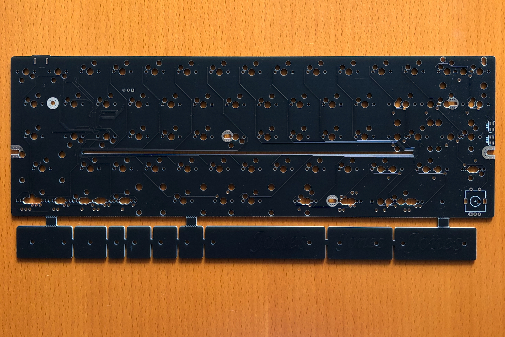
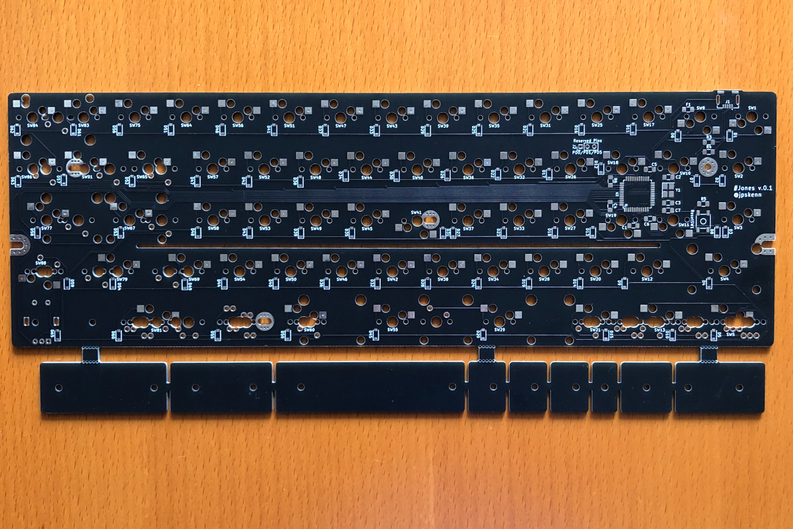
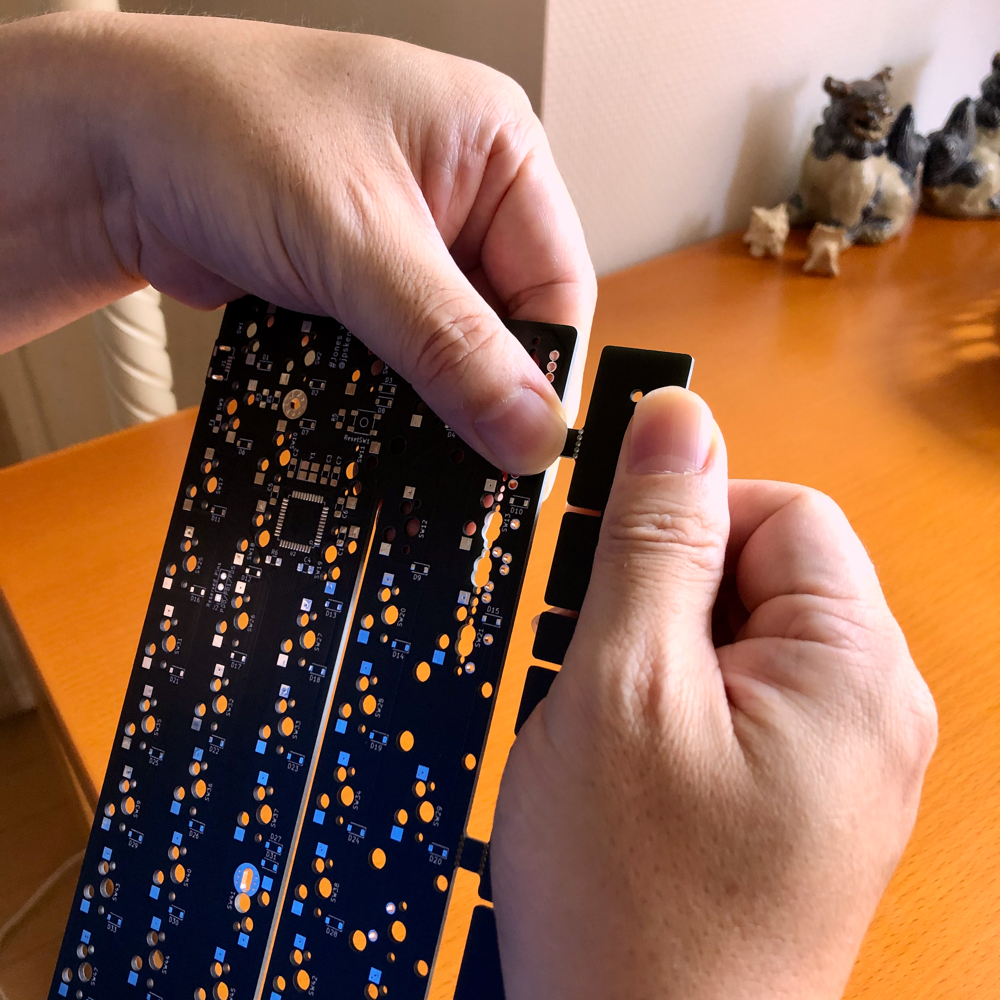
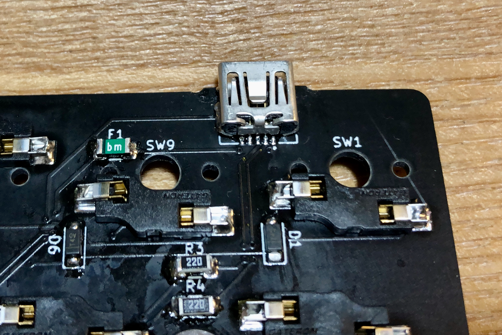
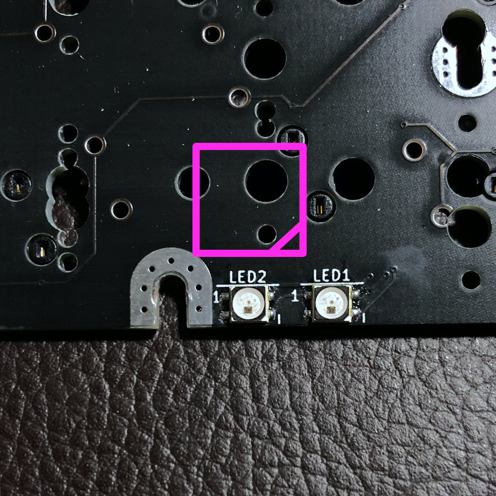
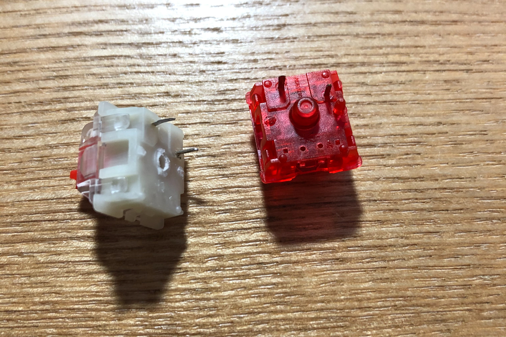

# Jones v.0.1 ビルドガイド

**Jones v.0.1は試作版です。**

*キーボード基板としての機能には問題ありませんが、ブロッカーのネジ位置が合わず取り付けできないものがあります。*

## 注意事項、制限など

制作にあたり、次のような注意事項、制限があります。

### ケースのネジ穴とスイッチの足の干渉  
市販のケースはJonesレイアウト向けに設計されていないので、ケースのネジ穴とスイッチの足が干渉する箇所があります。  

これらの箇所では、基板を低頭ネジでケースへ固定し、スイッチの足がネジ穴に重なる場合は、3pinのスイッチ、または足をカットした5pinスイッチを取り付けてください。  

レイアウトによっては、スイッチ中央の足（でっぱり部分）がネジに当たらないよう、1/4～1/3ほどカットする必要があります。  

### スイッチソケット  
レイアウトのバリエーションすべてをソケット化できないため、スイッチソケットに非対応の箇所があります。  

Mill-Maxソケットでソケット化するか、スイッチを直接はんだ付けしてください。

### スタビライザー  
Jonesレイアウトでは左シフトキーのサイズが2Uのため、スタビライザーを取り付けるとケース取り付けネジと干渉し、ネジ止めできなくなる場合があります。  

ネジ止めしなくても問題なく使用できますが、気になる方はスタビライザーを加工するなどの工夫が必要です。

### v.0.1の注意事項、制限

- 試作版のため、ブロッカーのネジ穴位置が合わず、取り付けられないものがあります。
- 基板のシルク表記が少ないため、部品の設置方向がわかりづらい箇所があるため、ビルドガイドで確認してください。
- コンデンサC5とSW19のソケットが干渉するため、コンデンサを少しずらして設置し、ソケットを削ることで回避可能です。

## 部品リスト

### 基本部品

キーボードとして動作させるのに必要な部品は次の通り。

| 部品名 | 個数 |
| ----- | -----: |
| Jones 基板 | 1 |
| USBコネクタ<br>Hirose UX60SC-MB-5S8(80)| 1 |
| リセットスイッチ<br>RS-187R05A2-DS MT RT | 1 |
| リセッタブルヒューズ<br>500mA トリップ1A 1206 | 1 |
| AVRマイコン<br>ATmega32U4-AU 44TQFP 10x10mm | 1 |
| クリスタル 16MHz 3225 | 1 |
| セラミックコンデンサ 0.1uF 1206 | 3 |
| セラミックコンデンサ 10uF 1206 | 1 |
| セラミックコンデンサ 1uF 1206 | 1 |
| セラミックコンデンサ 22pF 1206 | 2 |
| 抵抗 10k 1206 | 2 |
| 抵抗 22 1206 | 2 |
| ダイオード 1N4148 SOD-123 | 64 |
| MXソケット | 約60(\*) |
| MXスイッチ | 約60(\*) |

\* レイアウトによって使用数が変わります。


### オプション部品

追加機能を使用する場合に必要となる部品は次の通り。

| 部品名 | 個数 | 目的 |
| ----- | -----: | ----- |
| Mill-Maxソケット | 必要数 | MXソケット非対応箇所のソケット化 |
| LED SK6812MINI | 2 | インジケータLED |
| ロータリーエンコーダ<br>EC11、EC12互換 | 1 | ロータリーエンコーダの設置 |
| キープレート（下記参照）| 1 | キースイッチをさらにしっかりと固定 |


#### キープレート

プレートマウントの5pinスイッチを使用すればある程度しっかりと固定できますが、さらにしっかりと固定したい場合は、キープレートを使用してください。

[切断堂](https://setsudando.jp)さんの1.5mmステンレスなら、4000円程度で作成できます。（2020年8月現在）

キースイッチの爪がかからなくなりますが、MDFやアクリルでも作成できると思います。(未作成)

キープレートは以下のデータを使用して作成できます。  
[キープレート（SVG）](../assets/keyplate_SplitSpace_Merged_14x14.svg)  
[キープレート（DXF）](../assets/keyplate_SplitSpace_Merged_14x14.dxf)

自分好みのキープレートを作成したい場合は、Keyboard Layout Editorの[Jones v.0.1](http://www.keyboard-layout-editor.com/#/gists/62a2e13a54e2d129532bc8758cfc1e79)を参照してください。


## 組み立てに必要な工具
ドライバー、ピンセット、はんだ付け関連用品など、一般的な電子工作向け工具が必要です。  
また、MCUやUSBコネクタ取り付け後の確認にテスターが必要です。

以上に加え、やすりがあると仕上がりがきれいになります。  
また、ヘッドマウント型のルーペがあると細かいはんだ付けが楽になります。


## 基板概要

### 基板 表面

左上にUSBコネクタ部分の出っ張りがあるように置いた状態が表面。

  

### 基板 裏面

右上にUSBコネクタ部分の出っ張りがあるように置いた状態が裏面。  
裏面には、シルク印刷がたくさんあります。

  

### ブロッカー部

基板の下部に連結されている細長い部分。

### 回路図
  

[回路図 PDF](../assets/Jones_v.0.1_schematic.pdf)  

## 組み立て手順

部品の実装は、特に記載がない限り、基板裏面へ取り付けます。  

以下の部品のみ、表面から取り付けます。
- スタビライザー
- MXスイッチ
- インジケータ用のLED
- ロータリーエンコーダ

### 基板の切り離し

ブロッカー部を切り離します。  

マウスバイトの両側を指でつまみ、折り曲げて切り離します。  

  

切り離した箇所はとがっているので、ニッパーでカットしたり、やすりで削っておきます。  

### MCU、USBコネクタ関連部品の取り付け

各部品の取り付け説明と、部品の取り付け例の写真を参考に、作業してください。

  
部品の取り付け例

  
MCU, クリスタルの取り付け方向

#### MCU
U2へ、MCU上面の●印を、基板のマークに合わせて取り付けてください。  
取り付け後、テスターで端子がショートしていないか確認します。


#### クリスタル
Y1へ、クリスタルに書かれた文字の左下が、基板のマークに合うように取り付けます。  
取り付け後、テスターで端子（基板上のパッド）がショートしていないか確認します。

#### コンデンサ、抵抗、リセッタブルヒューズ
これらの部品はどちら向きに取り付けてもかまいません。  
以下の部品記号に対応する部品を取り付けます。  

| 部品記号 | 取り付け部品 |
| ----- | ----- |
| C1(*) | セラミックコンデンサ 10uF 1206 |
| C2, C3 | セラミックコンデンサ 22pF 1206 |
| C4, C5, C7 | セラミックコンデンサ 0.1uF 1206 |
| C6 | セラミックコンデンサ 1uF 1206 |
| F1 | リセッタブルヒューズ<br>500mA トリップ1A 1206 |
| R5, R6 | 抵抗 10k 1206 |
| R3, R4 | 抵抗 22 1206 |

\* v.0.1では、コンデンサC1とSW19のソケットが干渉する箇所があるため、コンデンサC1をMCU側へ少しずらして取り付けます。

#### リセットスイッチ
どちら向きに取り付けても大丈夫です。

#### USBコネクタ
コネクタを基板裏面から差し込み、端子が基板のパッドの真上にように位置を調整してマスキングテープなどで仮固定しておきます。  
その状態で、コネクタの足を基板の表面からはんだ付けします。

  
はんだ付けしたUSBコネクタの足（基板表面）

端子と基板のパッドがずれていないことを確認し、端子をはんだ付けします。

  
はんだ付けしたUSBコネクタの端子


取り付け後、テスターで端子がショートしていないか確認します。  
端子と端子の間隔が狭いため、ケーブルを接続してケーブル反対側のコネクタで確認するのもひとつの方法です。

### PCやMacへの接続確認と、ファームウェアの書き込み
PCやMacで認識されるかを確認するため、ファームウェアを書き込みます。  

#### 初回接続時にデバイスが認識されていることを確認する
QMK ToolboxでDFUデバイスが接続されたことを確認するか、OSの機能を使用して確認してください。

##### Mac
Jonesを初めてUSB接続したとき、システムレポートのUSBに、`Atmega32U4DFU`というデバイス名が表示されることを確認します。

なお、ファームウェア書き込み後は、`jones`というデバイス名で表示されます。  


##### Windows
どのように認識されるか未確認です。

#### ファームウェアを書き込む。

ファームウェアは以下よりダウンロードし、QMK Toolboxや、QMKのmakeコマンドなどで書き込んでください。  

- QMK Toolbox用hexファイル：[jones_v.0.1_default.hex](../assets/jones_v.0.1_default.hex)  
- QMKコマンド用キーボード関連ファイル：[qmk_firmware/keyboards/jones/](https://github.com/jpskenn/qmk_firmware/tree/master/keyboards/jones)


##### QMK Toolbox
ダウンロードしたhexファイル`jones_v.0.1_default.hex`を指定し、MCUは`atmega32u4`を選択しておきます。  
キーボードのリセットスイッチを押して、  

`*** DFU device connected`  

というメッセージが表示されたら、Flashボタンを押して書き込みます。

##### QMKコマンド
ダウンロードしたファイルをQMKのkeyboardsディレクトリ配下へ配置し、下記のコマンドを実行します。  

`make jones/v.0.1:default:dfu`  

ファームウェアが作成され、

```
dfu-programmer: no device present.
ERROR: Bootloader not found. Trying again in 5s.
```

というメッセージが表示されたら、キーボードのリセットスイッチを押すと書き込みが行われます。


### キースイッチ関連部品、オプション部品の取り付け

#### ダイオードの取り付け

※v.0.1では取り付け方向のシルクがありません。  
基板の手前側がカソード（奥→手前）になるように取り付けてください。  

  
ダイオード取り付け方向

#### LEDの取り付け（オプション）
基板表面のLED1、LED2へ取り付けます。  

このLEDは熱に弱いため、270℃程度で数秒内に取り付けるなどして、LEDが壊れないよう注意してください。

  
LED2 LED1がこのように見える方向に基板を置いたとき、右下にLEDの切り欠きを合わせます。

#### スイッチソケットの取り付け
使用するレイアウトに合わせて取り付けます。  

スイッチソケット非対応の箇所は、mill-maxソケットでソケット化するか、スイッチを直接はんだ付けしてください。

※SW19のソケットとコンデンサC1が干渉する場合は、ソケットをやすりで削るなどして対処します。  

#### ロータリーエンコーダの取り付け（オプション）

基板表面の右下の枠内へ取り付けます。


#### スタビライザーの取り付け
使いたいレイアウトに合わせて、取り付けるスタビライザーの位置を確認してください。  

なお、左シフトキーのスタビライザーがケースネジと干渉する場合があります。  
ネジ止めしなくても問題なく使用できますが、気になる場合はスタビライザーを装着しないなどの工夫が必要です。  


#### キースイッチ、キープレート（オプション）の取り付け

※ケース中央、ケース右上のネジ穴にキースイッチが重なるレイアウトの場合は、その部分だけケースへ取り付けた後にスイッチを取り付けます。

オプションのキープレートを使用する場合は、上から  
スイッチ → キープレート → 基板  
の順に取り付け、スイッチとキープレートがきっちりはまるようにします。
4隅のスイッチを取り付けてから、残りを1個ずつ確認しながら取り付けていくのがおすすめです。

ソケット化していない箇所は、スイッチを取り付けたらはんだ付けします。


##### ケース中央、ケース右上のネジ穴に重なるキースイッチ  

ケース中央のねじ穴に重なるスイッチは、3pinのスイッチを使用するか、片方の足をカットした5pinスイッチを使用してください。  

ケース右上のねじ穴に重なるスイッチは、上記の対応に加え、スイッチ中央の足（でっぱり部分）をネジに当たらないよう1/4～1/3ほどカットしてください。  

  
キースイッチの加工  
左：足を全てカットしたGateron Silent Red  
右：片方の足をカットしたGateron Ink Red

スイッチによっては　装着できない場合もありますので、ひとつふたつダメにするくらいの気持ちで作業してください。


#### ブロッカーの取り付け（オプション）

※v.0.1ではネジ穴の位置が合わない箇所があるため、加工が必要になります。  
M2ネジとスペーサーでブロッカーを取り付けます。  
場合によってはワッシャーなどを使用してください。


### 基板のケースへの取り付け

基板奥側をケースへ入れ、USBコネクタをケースの穴に合わせるようにして、基板全体をケースに納めます。

USBコネクタがケースの穴に入れば、基板全体がスッとケース内に入ります。  
ぐいぐいと力をかけて押し込むようなことはしません。

KBDfansのTOFUでは問題ありませんが、お安いプラスチックケースの場合は、基板がケース内のリブに干渉して、ぐらぐらすることがあります。  
この場合は、次の写真のように、リセットスイッチの穴とねじ穴のポストの間のリブをカットします。

  


ケースと基板のネジ穴がぴったり合うように位置を調整し、ネジ止めします。  
キースイッチと重なる箇所は低頭ネジを使います。

最後に、キースイッチの動作確認をして完成です。
