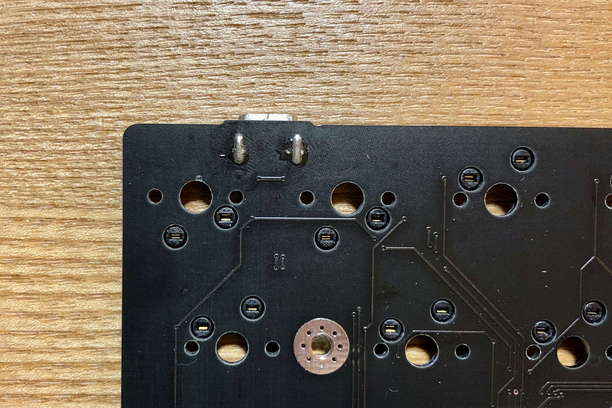

# Jones v.0.2 ビルドガイド

## 注意事項、制限など

制作にあたり、次のような注意事項、制限があります。

- ケースのネジ穴とスイッチの足の干渉  
市販のケースはJonesレイアウト向けに設計されていないので、ケースのネジ穴とスイッチの足が干渉する箇所があります。  
これらの箇所では、基板を低頭ネジでケースへ固定し、スイッチの足がねじ穴に重なる場合は、3pinのスイッチ、または足をカットした5pinスイッチを取り付けてください。  

 レイアウトによっては、スイッチ中央の足（でっぱり部分）がネジに当たらないよう、1/4～1/3ほどカットする必要があります。  

- スイッチソケット
レイアウトのバリエーションすべてをソケット化できないため、スイッチソケットに非対応の箇所があります。  
Mill-Maxソケットでソケット化するか、スイッチを直接はんだ付けしてください。

- スタビライザー
Jonesレイアウトでは左シフトキーのサイズが2Uのため、スタビライザーを取り付けるとケース取り付けネジと干渉し、ねじ止めできなくなる場合があります。  
ネジ止めしなくても問題なく使用できますが、気になる方はスタビライザーを加工するなどの工夫が必要です。

### v.0.2の注意事項、制限

- LEDテープ用シルクの間違い  
シルク表記のGNDと+5Vが逆になっています。  
誤：GND/LED/+5V  
正：+5V/LED/GND

## 部品リスト

### 基本部品

| 部品名 | 個数 |
| ----- | -----: |
| Jones 基板 | 1 |
| USBコネクタ MOLEX 548190519| 1 |
| リセットスイッチ RS-187R05A2-DS MT RT | 1 |
| リセッタブルヒューズ 500mA トリップ1A 1206 | 1 |
| MXソケット | 約60(\*) |
| MXスイッチ | 約60(\*) |

\*レイアウトによって使用数が変わります。

### オプション部品

| 部品名 | 個数 |
| ----- | -----: |
| Mill-Maxソケット | 必要数 |
| LED SK6812MINI | 2 |
| ロータリーエンコーダ EC11、EC12互換 | 1 |
| ブロッカー（基板に付属） | 必要数 |
| キープレート（下記参照）| 1 |

#### キープレート

発注について

## 組み立てに必要な工具
ドライバー、ピンセット、はんだ付け関連用品など、一般的な電子工作向け工具が必要です。  
また、MCUやUSBコネクタ取り付け後の確認にテスターが必要です。

以上に加え、やすりがあると仕上がりがきれいになります。  
また、ヘッドマウント型のルーペがあると細かいはんだ付けが楽になります。

## 基板概要
〓基板全体写真　おもて〓
〓基板全体写真　裏〓

〓基板説明。捨て基板とかブロッカーとかの呼び方とかも。

## 組み立て手順

部品の実装は、特に記載がない限り、基板裏面へ取り付けます。
表面から取り付る部品は、スタビライザー、MXスイッチ、インジケータ用のLED、ロータリーエンコーダのみです。

### 基板の切り離し

捨て基板、ブロッカーパーツを切り離します。  
マウスバイトの両側を指でつまみ、折り曲げて切り離します。  
切り離した箇所はとがっているので、ニッパーでカットしたり、やすりで削っておきます。  
〓つまんで、折り曲げようとしている写真〓
〓バリと、やすった後写真〓

### MCU、USBコネクタ関連部品の取り付け

部品の取り付け例の写真を参考に、各部品を取り付けてください。

  
部品の取り付け例

  
MCU, クリスタルの取り付け方向

#### MCU
MCU上面の●印を、基板のマークに合わせて取り付けてください。  
取り付け後、テスターで端子がショートしていないか確認します。

#### クリスタル
クリスタルに書かれた文字の左下が、基板のマークに合うように取り付けます。  
取り付け後、テスターで端子がショートしていないか確認します。

#### コンデンサ、抵抗、リセッタブルヒューズ
これらの部品はどちら向きに取り付けてもかまいません。  
以下の記号に対応する部品を取り付けます。  

| 部品記号 | 取り付け部品 |
| ----- | ----- |
| C1 | セラミックコンデンサ 10uF 1206 |
| C2, C3 | セラミックコンデンサ 22pF 1206 |
| C4, C5, C7 | セラミックコンデンサ 0.1uF 1206 |
| C6 | セラミックコンデンサ 1uF 1206 |
| F1 | リセッタブルヒューズ 500mA トリップ1A 1206 |
| R5, R6 | 抵抗 10k 1206 |
| R3, R4 | 抵抗 22 1206 |

※v.0.1では、コンデンサC1とSW19のソケットが干渉する箇所があるため、コンデンサC1をMCU側へ少しずらして取り付けます。

#### リセットスイッチ
どちら向きに取り付けても大丈夫です。

#### USBコネクタ
コネクタを基板裏面から差し込み、マスキングテープなどで仮固定しておき、コネクタの足を基板の表面からはんだ付けします。

USBコネクタの取り付けに少し遊びがあるため、端子が基板のパッドの真上に来るように取り付けてください。
  
USB パッド部  
  
USBコネクタの足（基板面面）  

取り付け後、テスターで端子がショートしていないか確認します。  
端子間が狭いため、ケーブルを接続してケーブル反対側のコネクタで確認するのもひとつの方法です。

### PCやMacへの接続確認と、ファームウェアの書き込み
MCU、USBコネクタ関連部品が正常に取り付けられ、PCやMacで認識されるかを確認するため、ファームウェアを書き込みます。  
初めてUSB接続したとき、Macでは  
〓システムレポートのUSBに、Atmega???〓  
というデバイス名が表示され、ファームウェア書き込み後は、  
〓Jones？〓  
というデバイス名で表示されます。  
（Windowsでどのように認識されるか未検証です。）

ファームウェアは以下よりダウンロードし、QMK Toolboxや、QMKのmakeコマンドなどで書き込んでください。  
QMK Toolbox用hexファイル：〓
QMKコマンド用キーボード関連ファイル：〓

QMK Toolbox：
hexファイルを指定しておきます。  
キーボードのリセットスイッチを押して〓DFUなんたらメッセージ〓が表示されることを確認します。  
Flashボタンを押して書き込みます。

QMKコマンド：
ダウンロードしたファイルをQMKのkeyboardsディレクトリ配下へ配置します。  
下記コマンドを実行します。

〓not foundメッセージ〓が表示されたら、キーボードのリセットスイッチを押します。
書き込みが行われます。

### キースイッチ関連部品の取り付け

ダイオードを取り付けます。  

※v.0.1では取り付け方向のシルクがありません。  
キーボード手前側がカソード（奥→手前）になるように取り付けてください。  
〓方向の写真（引いた図に拡大したものを入れ込んで1枚に〓

スイッチソケットを取り付けます。  
使用するレイアウトに合わせて取り付けます。  
スイッチソケット非対応の箇所は、mill-maxソケットでソケット化するか、スイッチを直接はんだ付けしてください。

※v.0.1では、SW19のソケットとコンデンサC1が干渉するため、ソケットをやすりで削るなどして対処します。  
スイッチ中央穴にかからない方向で取り付けます。  
〓けずる感じ〓

スタビライザーを取り付けます。  
使いたいレイアウトに合わせて、取り付けるスタビライザーの位置を確認してください。  
〓スタビライザーの設置〓
なお、左シフトキーのスタビライザーを取り付けると、この部分はケースへネジ止めできなくなります。  
ネジ止めしなくても問題なく使用できますが、気になる方はスタビライザーを装着しないなどの工夫が必要です。  
〓ネジ干渉〓

キースイッチを取り付けます。
5pinのスイッチは差し込みが硬いことがあるため、奥までしっかりと差し込みます。

オプションのキープレートを使用する場合は、スイッチ→キープレート→基板の順に取り付け、
スイッチとキープレートがきっちりはまるようにします。
4隅のスイッチを取り付けてから、残りを1個ずつ確認しながら取り付けていくのがおすすめです。

ソケット化していない場合は、スイッチを取り付けたらはんだ付けします。

※ケースネジ穴とスイッチ”H”と”[”〓レイアウトによって”[”じゃないときがある〓の足が干渉します。
これらの箇所では、低頭ネジを使用してケースへ固定してください。
”H”キーでは、3pinのスイッチを使用するか、片方の足をカットした5pinスイッチを使用してください。
”[”キーでは、上記の対応に加え、スイッチ中央の足（でっぱり部分）をネジに当たらないよう1/4～1/3ほどカットしてください。
スイッチによっては　装着できない場合もありますので、ひとつふたつダメにするくらいの気持ちで作業してください。
足加工による取り付け確認済みスイッチ：Gateron 静音赤, Gateron 静音白, Gateron Ink Red
〓足カットしたスイッチ〓
〓低頭ネジつけてるところ〓

PCなどに接続し、正常にキー入力できるか確認します。

### オプション部品の取り付け

（オプション）LEDを取り付けます。
基板表面のLED1、LED2へ取り付けます。
※v.0.1では取り付け方向のシルクがありません。〓ないか？〓
3と書いてあるところに、LEDの▲マークを合わせます。
〓LED方向〓

（オプション）ロータリーエンコーダを取り付けます。
基板表面の〓SWxx〓へ取り付けます。
〓RE取り付け図〓

（オプション）ブロッカーを取り付けます。
ネジとスペーサーでブロッカーを取り付けます。
〓ブロッカー取り付け図〓

### ケースへ取り付けます。

基板奥側から先にケースへ入れ、USBコネクタをケースの穴に合わせるようにして、基板全体をケースに納めます。
ケースと基板のねじ穴がぴったり合うように位置を調整し、ねじ止めします。
〓シフトのネジ入らんかも〓
