# Jones v.0.3.1 ビルドガイド

購入していただいた方、リポジトリから製造していただいた方、その他の皆様、Jonesに興味を持っていただきありがとうございます。

Jonesのコンセプトや特徴などについては、[Jones README](https://github.com/jpskenn/Jones/blob/master/README.md)をご覧ください。

## 注意事項、制限など

- 一部の金属製ケースと組み合わせて使用した場合、誤入力が発生する場合があります。

    [誤入力対策](#誤入力対策)を参照してください。

- v.0.3.1の基板設計ミスにより以下の制限があります。（v.0.3.2では制限なし）  
    - 基板の配線を1箇所カットしてあります。（写真の矢印部分）
    - ANSIスタイルの”[”キーは、`SW_[1`のMXソケットを使用できません。（写真の×部分）  
    `SW_[2`へ取り付け済みのmill-maxソケットへ、スイッチを取り付けてください。（写真の○部分）  
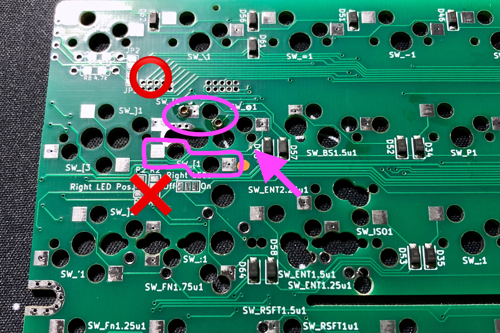  

    - JPスタイルのレイアウトを使用する際は、`SW_[2`へ取り付け済みのmill-maxソケットを取り外してください。  
    SW_@1へ取り付けるスイッチと干渉します。  
  基板の裏側から、mill-maxソケット側面をはんだごてで温めながら爪楊枝などで押し込むと、ポロッと外れます。

- ケースのネジ穴とスイッチの足が干渉する箇所では、スイッチの足を加工して取り付ける箇所があります。  

    Hキーは、3pinまたは片方の足をカットした5pinスイッチを取り付けます。  
基本的なANSIスタイルの[キーは、中央の足（でっぱり部分）を一部カットして取り付けます。

- 個性的なレイアウトは、スイッチソケットに対応していない箇所があります。  

    基本的なレイアウトのANSIとJPスタイルはスイッチソケットに対応しています。  
詳しくは以下のレイアウト図で確認してください。  
[Jones v.3.5.4 ソケットとスイッチ穴の方向](http://www.keyboard-layout-editor.com/#/gists/ef36178a15efbbe5e7411bcdeef87fc4)

- スイッチを上下逆向きに取り付ける箇所があります。  

    USBコネクタやネジ穴に干渉するキーや、複数のレイアウトを選べるキーは、スイッチを上下逆向きに取り付ける箇所があります。  
キーキャップによっては、キャップとスイッチが当たるかもしれません。（GMKのキーキャップでは当たることがあるようですが、所有していないため試せていません）  

    一部のキーは、上下逆向きを回避するための非ソケットのスイッチ穴が使える箇所もあります。  
詳しくは以下のレイアウト図で確認してください。  
[Jones v.3.5.4 ソケットとスイッチ穴の方向](http://www.keyboard-layout-editor.com/#/gists/ef36178a15efbbe5e7411bcdeef87fc4)

- 2U幅の左シフトキー用のスタビライザーは、ケースネジと左側LEDに干渉するため推奨しません。  

    左シフトキーは1.75U幅を使用するか、2U幅をスタビライザーなしで使用することをおすすめします。  

    2U幅の左シフトキー用のスタビライザーを使用する場合は、左側LEDを設置できません。  
また、スタビライザーを一部カットして取り付けるなどの工夫が必要です。

- もしかしたら、取り付けできないケースがあるかもしれません。  

    全てのGH60型ケースに取り付けできるかは、なんとも言えません…  
現在のところ、取り付け確認済みのケースは次の通りです。  
    - [KBDfans TOFU 60% ALUMINUM CASE](https://kbdfans.com/products/kbdfans-tofu-60-aluminum-case)  
    - [KBDfans 5° FROSTED ACRYLIC CNC 60% CASE](https://kbdfans.com/products/pre-order-kbdfans5-transparent-acrylic-cnc-60-case)  
    - [60% プラスチックケース](https://yushakobo.jp/shop/60-plastic-case/)（簡単な加工が必要）

    上記以外のケースへの取り付けの成功／失敗の報告を募集しております。


## 部品リスト

このキットを組み立てるためには、”キット内容物”に加え、”別途用意が必要な部品”が必要です。  
好みのものをお買い求めください。

なお、”オプション部品”は使いたい機能などに合わせて任意に用意してください。  

### キット内容物

| 部品名 | 個数 |
| ----- | -----: |
| Jones 基板 v.0.3.1 | 1 |
| Jones キープレート v.3.5.4 | 1 |
| USBコネクタ<br>GCT USB4085-GF-A| 1 |
| リセットスイッチ<br>RS-187R05A2-DS MT RT（または同等品） | 1 |
| 低頭ネジ<br>M2 4mm | 4(\*) |
| 低頭ネジ<br>M2 5mm | 4(\*) |

\* レイアウトとネジ止め箇所によって使用数が変わります。  
ケースネジの長さに合わせて使用し、残りはケース付属のネジを使用します。

### 別途用意が必要な部品

| 部品名 | 個数 |
| ----- | -----: |
| MXソケット | 最大 69(\*) |
| MXスイッチ | 最大 69(\*) |
| PCBマウント スタビライザー：2U<br>（ねじ止め式を推奨） | 3(\**) |
| キーキャップ | 必要数(\*) |
| ケース（GH60型） | 1 |
| USBケーブル （Type-C） | 1 |

\*レイアウトによって使用数が変わります。  
\**2Uの幅の左シフト（非推奨）を使用する場合は4。

### オプション部品

| 部品名 | 個数 | 使用機能, 備考 |
| ----- | -----: | ----- |
| Mill-Maxソケット | 必要数 | 個性的なレイアウト |
| LED<br>SK6812MINI | 最大 6 | インジケータLED |
| LEDテープ<br>26cm程度(\*) | 1 | アンダーグローLED |
| ロータリーエンコーダ<br>EC11, EC12またはその互換品 | 最大 2 | ロータリーエンコーダ |
| ロータリーエンコーダ用ノブ（つまみ） | 最大 2 | ロータリーエンコーダ |
| スピーカー<br>Murata PKMCS0909E4000-R1 | 1 | スピーカー |
| カプトンテープ | 必要な長さ | アンダーグローLEDの貼り付け,<br>絶縁など |

\*ファームウェアは1mに60個のLEDが配置されたLEDテープを想定して作成しています。

## 組み立てに必要な工具
ドライバー、ピンセット、はんだ付け関連用品など、一般的な電子工作向け工具を使用します。  
[遊舎工房の工具セット](https://yushakobo.jp/shop/a9900to/)を参考に用意してください。

安いものでもかまわないので、USBコネクタなどの導通確認にテスターを用意してください。  
作業の確認や、何か不具合があったときの原因調査にも使えます。


## 基板概要

（写真はv.0.3基板のため細部が少し異なります。）

- 基板おもて側  
部品が何も取り付けられていません。


- 基板裏側  
細かな部品がたくさん取り付けられています。
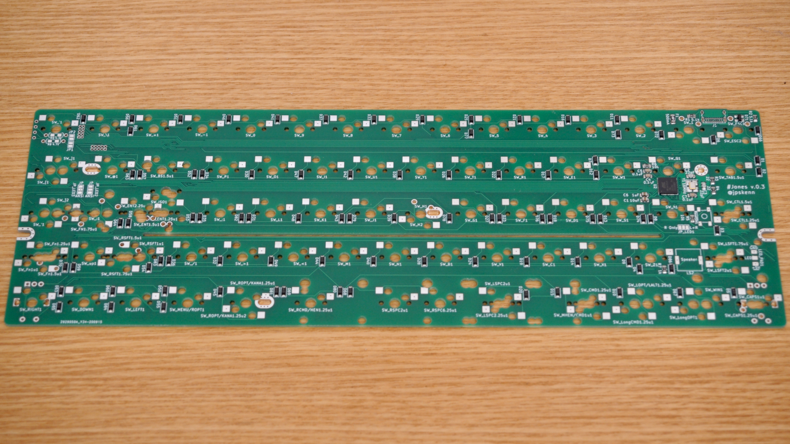

- キープレートおもて側  
右上に切り欠きがあります。
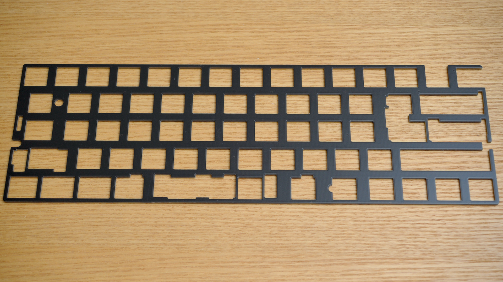

## 組み立て手順

*作業をおこなう前に、各手順に目を通しておくと作業ミスの防止につながります。*


### 誤入力対策（v.0.3.2は対策不要）

一部の金属製ケースと組み合わせて使用した場合に、誤入力が発生する問題への対策をおこないます。

基板をおもて側にして、中央ネジ穴付近と下のネジ穴付近の、2箇所の作業箇所を確認します。

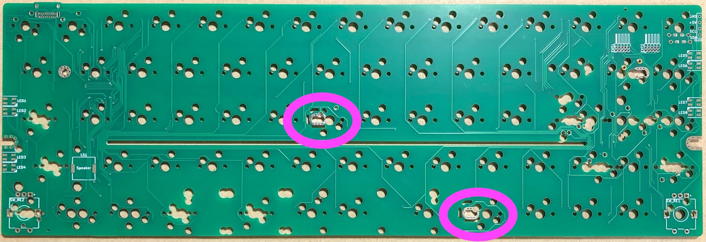
2箇所の作業箇所

#### 1箇所目

基板をおもて側にして、中央ネジ穴付近の配線を、写真で示した位置でカットします。 

カッターやマイナスドライバーを使い、他の配線を傷つけないように注意しながら、少しずつ削ります。 
1回でカットしようとせず、数回〜20回くらいにわけて少しずつ削ります。


中央ネジ穴付近、配線カット箇所

配線をカットしたら、基板をうら側にします。 
中央ネジ穴とダイオードD78の下側を、テスターで導通が**ない**ことを確認します。

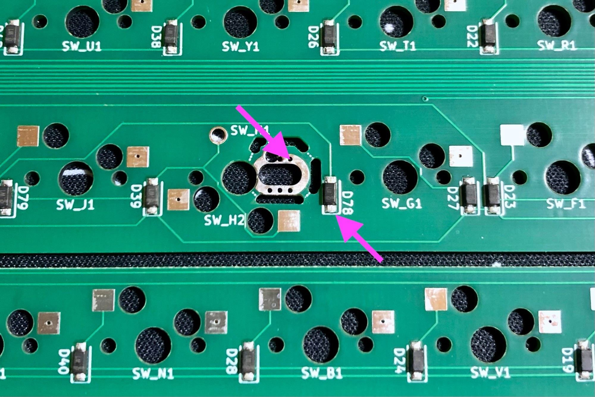 
1箇所目のテスター確認箇所


#### 2箇所目

基板をおもて側にして、下のネジ穴付近の配線を、写真で示した位置でカットします。

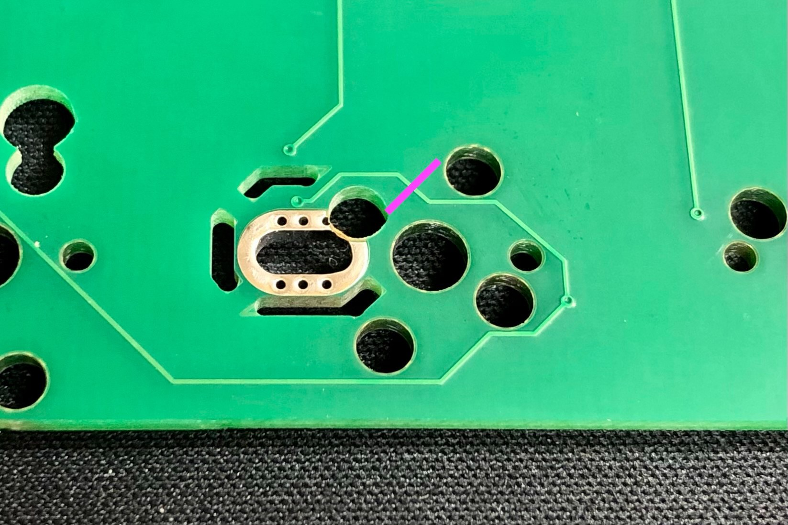

配線をカットしたら、基板をうら側にします。 
下のネジ穴と写真で示した正方形のパッドを、テスターで導通が**ない**ことを確認します。

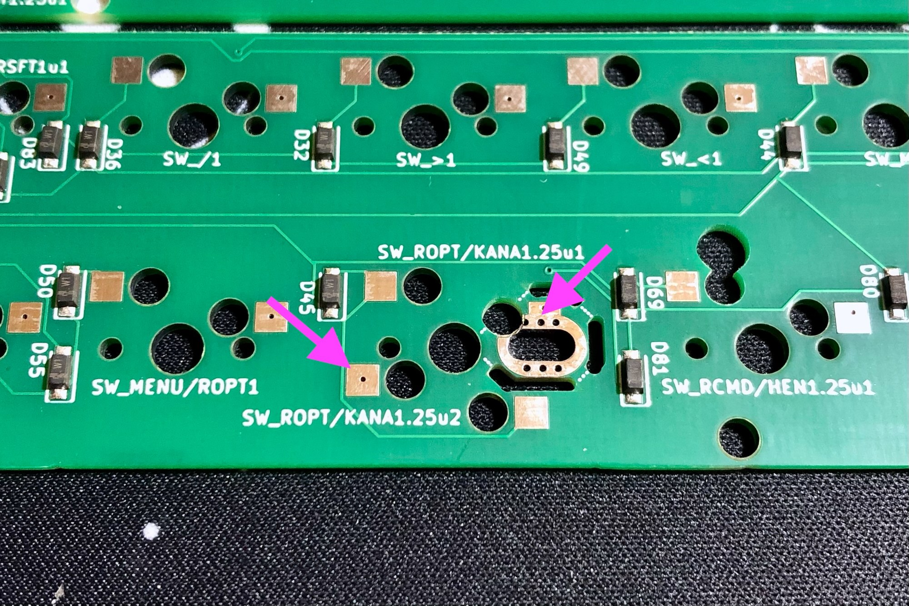 
2箇所目のテスター確認箇所


### リセットスイッチの取り付け

基板裏側の`ResetSW1`へ取り付けます。

基板のパッド4箇所のうち、1箇所だけに予備はんだします。

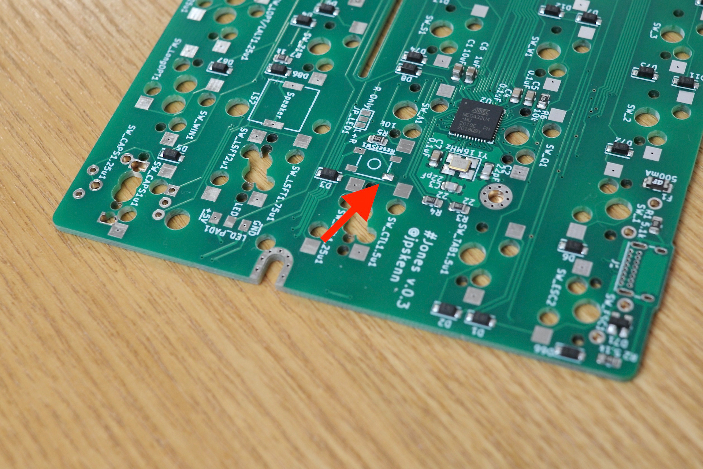
予備はんだ

リセットスイッチを基板のパッド位置に合わせて置きます。  
方向はどちら向きでも大丈夫です。

予備はんだしておいた箇所をはんだ付けします。

位置がずれていないことを確認します。

残りのパッド3箇所をはんだ付けします。

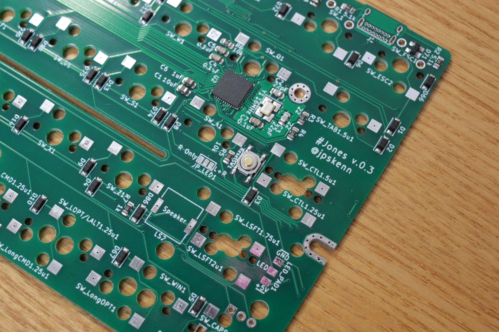
取り付けたリセットスイッチ


### USBコネクタの取り付け

基板裏側の`J1`へ取り付けます。

コネクタを基板裏側から差し込み、マスキングテープなどで仮固定します。


仮固定したUSBコネクタ

基板をひっくり返し、基板おもて側から、4本ある足の長い方の1本だけをはんだ付けします。  
コネクタがまっすぐ奥まで差し込まれた状態ではんだ付けされるようにします。

残り3本の足をはんだ付けします。

コネクタのピンをはんだ付けします。  
フラックスを塗っておくとはんだ付けしやすくなります。  
ピンはスルーホールからほとんど出ていないため、スルーホールにはんだを流し込むような具合ではんだ付けします。  
スルーホールの向こう側（基板おもて側）にはんだが溢れてしまわないよう、流し込みすぎないように注意します。


取り付けたUSBコネクタ

目視で、隣り合ったピン同士がはんだでくっついていないことを確認します。

USBコネクタ接続図を参考に、テスターで全てのピン間での導通を確認します。  
- A6とB6、A7とB7のように、緑または赤の線でつながっているピンや、GND同士、VCC同士で導通があることを確認します。  
- A1とA4、B6とB7のように、緑または赤の線でつながっていないピンでは導通しないことを確認します。  


USBコネクタ接続図

例えば、A1との導通は、次のようになります。

| ピン | 導通 |    | ピン | 導通 |
| --- | :---: | --- | --- | :---: |
| A1 | － | | B1 | あり |
| A4 | なし | | B4 | なし |
| A5 | なし | | B5 | なし |
| A6 | なし | | B6 | なし |
| A7 | なし | | B7 | なし |
| A8 | なし | | B8 | なし |
| A9 | なし | | B9 | なし |
| A12 | あり | | B12 | あり |


### キーボードの接続確認
以下の手順Aまたは手順Bのいずれかをおこない、PCやMacでキーボードが認識されることを確認します。

接続が確認できない場合は、USBコネクタの取り付け不良などが疑われます。  
はんだ付けしたコネクタ端子、USBケーブル接続部分、コネクタに接続したケーブルの反対側などをテスターで確認してください。

#### 手順A QMK Toolboxによる確認
[QMK Toolbox](https://docs.qmk.fm/#/ja/newbs_getting_started?id=qmk-toolbox)をダンロードし、使用できる状態にしておきます。  

QMK Toolboxを起動します。

キーボードを接続します。

QMK Toolboxのメッセージエリアに、以下のメッセージが表示されれば、接続確認はOKです。

    *** DFU device connected

  
表示されたメッセージ


#### 手順B OSのデバイス管理機能による確認

キーボードを接続します。

##### Mac

　→　このMacについて　→　システムレポート… を開きます。

ハードウェアのUSBに、`ATm32U4DFU`のデバイスが表示されていれば、接続確認はOKです。

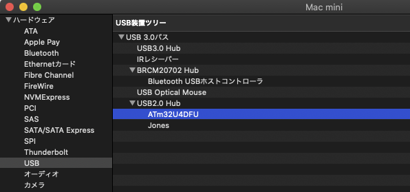  
システムレポートの表示  
（下に`Jones`と表示されているのは、以前作成したv.0.2のJonesです💦）

##### Windows

（調査中）


### ファームウェアの書き込み
このあとの作業で各機能の動作確認をおこなうため、ファームウェアを書き込みます。

ファームウェアは以下よりダウンロードし、QMK Toolbox、またはQMKのコマンドなどで書き込んでください。  
なお、各ファイルは本家QMKには取り込まれていませんので、私がフォークしたリポジトリから取得してください。

- QMK Toolbox用hexファイル：  
[基本的なANSIスタイル用](https://gist.github.com/jpskenn/e458aba60c828ac9f2b4f6b7c2098455)  
[基本的なJPスタイル用](https://gist.github.com/jpskenn/6c6ec73f580b8839b76e3e6510bacca9)  

- QMKコマンド用キーボード関連ファイル：  
[jpskenn/qmk_firmware: develop_Jonesブランチ](https://github.com/jpskenn/qmk_firmware/tree/develop_Jones/)

#### QMK Toolbox
書き込むhexファイルを指定します。  

キーボードを接続します。

キーボードのリセットスイッチを押して、`*** DFU device connected`が表示されることを確認します。  

Flashボタンを押して書き込みます。

写真のような書き込みメッセージが表示されれば完了です。

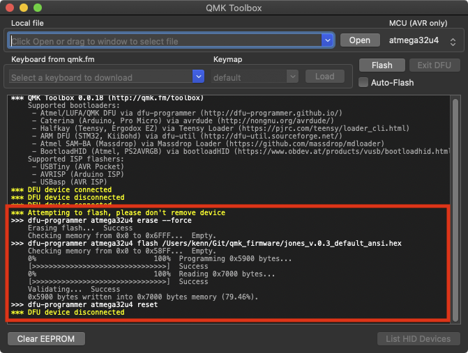  
書き込みメッセージ  
（ファイル名や%の数値などは実際と異なる場合があります）

#### QMKコマンド
ダウンロードしたファイルをQMKのkeyboardsディレクトリ配下へ配置します。  

キーレイアウトに合わせて、いずれかのコマンドを実行します。

ANSIスタイル

    qmk flash -kb jones/v.0.3.1 -km default_ansi

JPスタイル

    qmk flash -kb jones/v.0.3.1 -km default_jp

何やら画面に表示された後、しばらくすると次のようなメッセージが繰り返し表示されます。

    dfu-programmer: no device present.
    ERROR: Bootloader not found. Trying again in 5s.

キーボードのリセットスイッチを押すと書き込みが始まります。

次のようなメッセージが表示されたら完了です。  
（%の数値などは実際とは異なる場合があります）

```
Bootloader Version: 0x00 (0)
Erasing flash...  Success
Checking memory from 0x0 to 0x6FFF...  Empty.
0%                            100%  Programming 0x6900 bytes...
[>>>>>>>>>>>>>>>>>>>>>>>>>>>>>>>>]  Success
0%                            100%  Reading 0x7000 bytes...
[>>>>>>>>>>>>>>>>>>>>>>>>>>>>>>>>]  Success
Validating...  Success
0x6900 bytes written into 0x7000 bytes memory (93.75%).
```

### （オプション・サポート外）基板のフレックス加工
基板から中央とスペースキー右側にあるネジ穴を切り取り、基板の左右だけでケースに固定することで基板を適度にしならせ、柔らかい打鍵感を得られる加工をおこなうことができます。  

打鍵感の好みは各個人で異なるため、一度組み立てて使ってみて、後から加工することもできます。  

なお、**この加工による基板の破損や、ケースへの取り付け不良が発生することが考えられるため、サポート外とします**。加工者の責任で作業をおこなってください。  
（KBDfans 5° FROSTED ACRYLIC CNC 60% CASEでは、特に問題なく快適に使用できています。）

加工箇所を確認します。  
加工すると正方向の`SW_ROPT/KANA1.25u` *`1`* のソケットは使えなくなるため、逆方向の`SW_ROPT/KANA1.25u` *`2`* のソケットを使用してください。（スイッチの位置は同じです）

  
基板裏側から見た加工箇所


ニッパーなどを使い、基板裏面に描かれた点線で切り離します。  
まわりの部品を傷つけないように気をつけながら、一度にカットせず、少しずつ切り進めていきます。

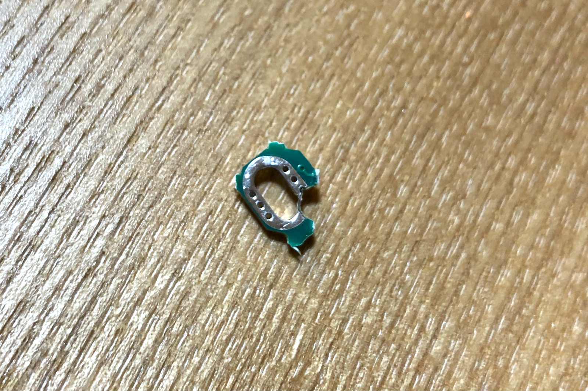  
切り取ったネジ穴

### スイッチソケットの取り付け
基板裏側から取り付けます。

使用するレイアウトに合わせて取り付け位置を確認します。  
1箇所に複数のキーが集まっているところは、スイッチやキーキャップを実際に置いてみるとわかりやすくなります。  

[  
Keyboard Layout Editor: Jones v.3.5.4](http://www.keyboard-layout-editor.com/#/gists/ab35444150ef1aff63ed32bbe2b9a1ef)  

基本的なANSIスタイルと、基本的なJPスタイルのレイアウトはスイッチソケットに対応しています。  
スイッチソケットに対応していない箇所は、mill-maxソケットでソケット化するか、スイッチを直接はんだ付けします。  

**注意：  
ネジ穴の上に位置するキーは、直接はんだ付けしてはいけません。  
ソケットを使用し、ネジ止めした後にスイッチを取り付けられるよう、ソケットを使用します。**

基板のソケット用パッドの片方だけに予備はんだします。


ソケット用パッドへの予備はんだ

ソケットを基板の穴にはまるように置きます。  
スイッチ中央の穴をソケットでふさがない向きが正しい方向です。


ソケットの方向

ピンセットでソケットを押さえながら、予備はんだしたところをはんだ付けします。  
金属部分の間へコテ先を押し込んで、1、2、3と数えたくらいではんだが溶け、浮いていたソケットが基板に接します。  
ソケットが基板に接したら、1、2と数えたくらいでコテ先を離し、そこから1、2と数えてからピンセットを離します。


金属部分へコテ先を押し込む

ソケットが基板から浮いていないことを確認します。  


ソケットの浮き


反対側の金属部分へコテ先を押し込み、1、2、3と数えて温めます。  
基板のパッドと金属部分の間あたりへはんだを押しつけ、溶かしながら隙間へ流し込みます。  
流し込んだら、1、2と数えてコテ先を離します。

パッドにはんだが広がる程度に流し込んでください。  
金属部分の間に、はんだがポコっと盛り上がって固まっていれば十分です。


取り付けたソケット


### （オプション）スピーカーの取り付け
基板裏側でジャンパして、おもて側にスピーカーを取り付けます。

基板裏側のジャンパ`simultaneous audio`をジャンパすると、2音同時再生できるようになります。  
ジャンパしない場合は単音で再生されます。

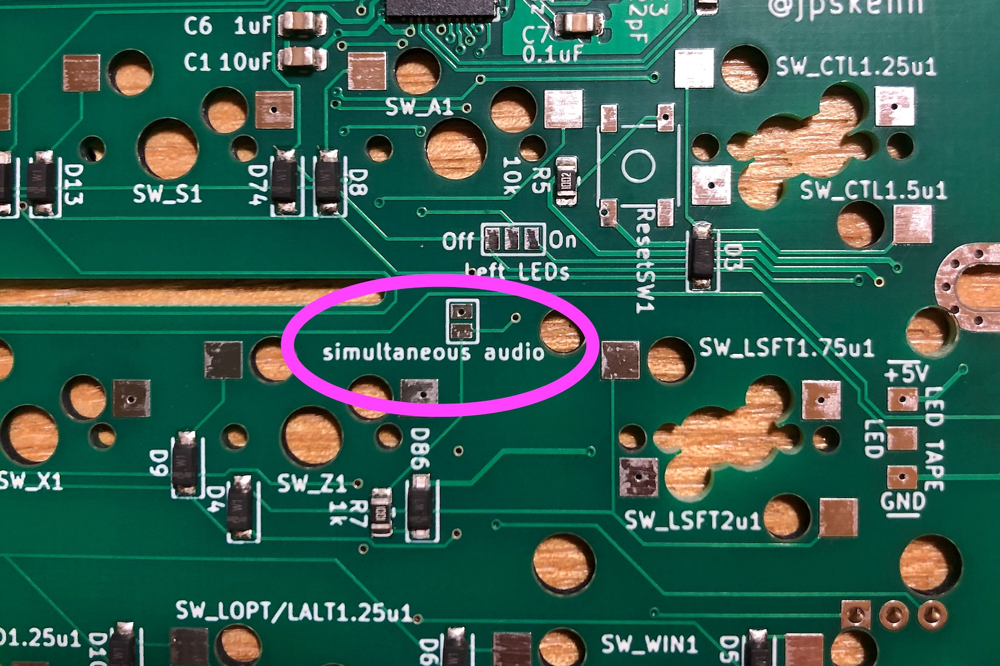  
ジャンパ箇所

  
ジャンパした状態

基板おもて側、スピーカー`LS1`のパッド2箇所のうち、1箇所だけに予備はんだしておきます。

スピーカーをパッドに合わせて置きます。  
どちらの方向に取り付けても大丈夫です。  
スピーカーの穴がキープレートの空き部分にくるような方向に取り付けると音が聞こえやすくなります。

予備はんだした箇所をはんだ付けします

スピーカーがまっすぐ取り付けられていることを確認します。

残りの1箇所をはんだ付けします。


取り付けたスピーカー

### （オプション）インジケータLEDの取り付け
基板裏側でジャンパし、おもて側の`LED1〜8`へ取り付けます。

インジケータLEDの組み合わせは次の通りです。  
左側LEDは4個、右側LEDは2行目または3行目のいずれかに2個取り付けます。

| 組み合わせ | 左側LED | 右側LED |
| :--: | :--: | :--: |
| A | なし | なし |
| B | なし | 2行目 |
| C | なし | 3行目 |
| D | あり | なし |
| E | あり | 2行目 |
| F | あり | 3行目 |

基板裏側のジャンパ`Left LEDs`を、左側LEDを使用する場合は`On`に、使用しない場合は`Off`にジャンパします。
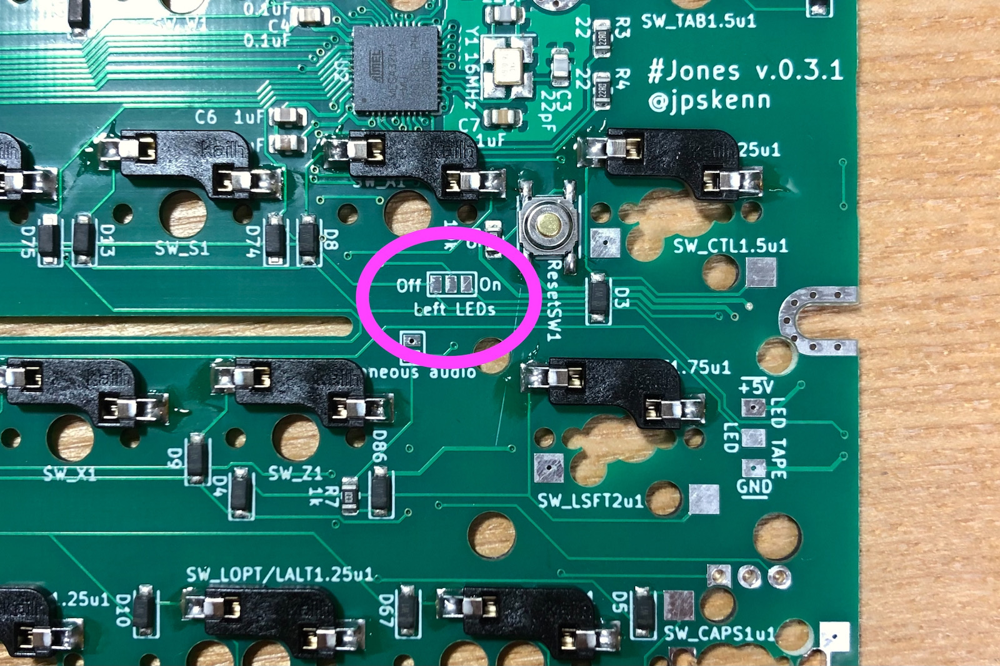  
左側LEDジャンパ位置

基板裏側のジャンパ`Right LEDs`を、右側LEDを使用する場合は`On`に、使用しない場合には`Off`にジャンパします。  
また、右側LEDを使用する場合は、基板裏側のジャンパ`Right LED Pos.`を、LEDの位置が2行目（＝R2）の場合は`R2`に、3行目（＝R3)の場合は`R3`にジャンパします。
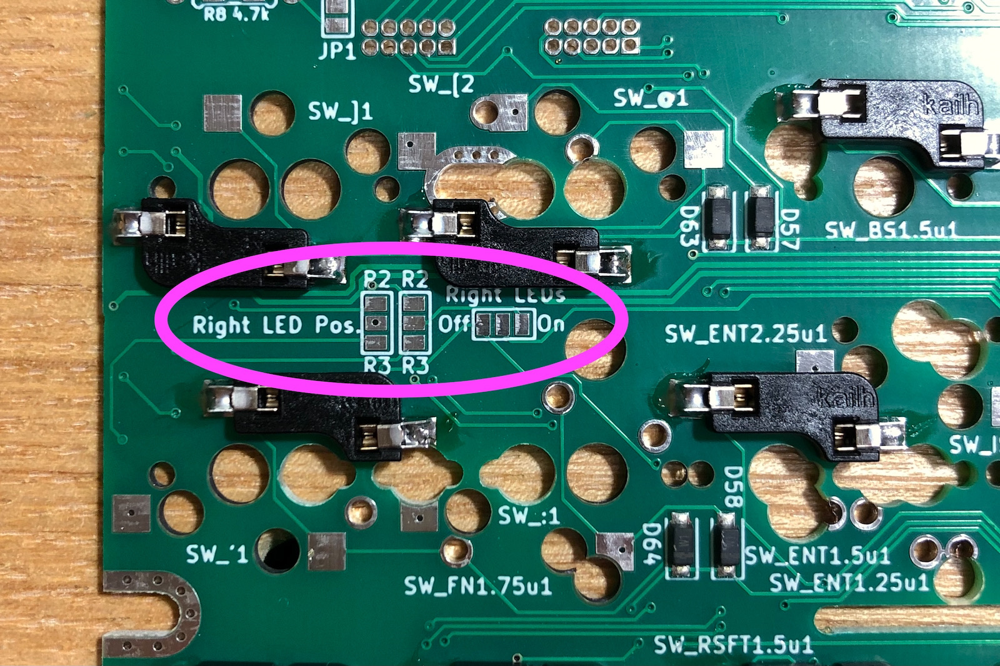  
右側LEDジャンパ位置

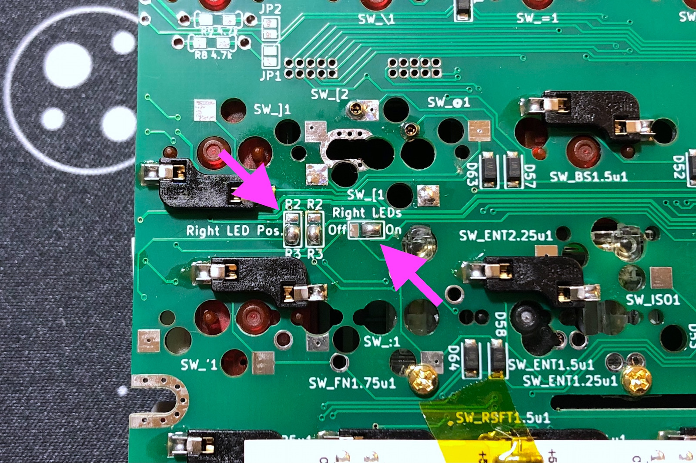  
右側LEDをON、右側LEDの位置を3行目（＝R3）にジャンパした状態

基板おもて側から、選んだ組み合わせの位置にLEDをはんだ付けします。
- 左側LED 4個： `LED1〜4`
- 右側LED 2個： 2行目 `LED5〜6`　または　3行目 `LED7〜8`

基板の各LEDのパッドそれぞれ4箇所のうち、1箇所だけに予備はんだしておきます。

LEDは高温ではんだ付けすると壊れるため、コテ先温度を220-270℃に設定します。
使用するはんだの種類や作業手順にもよりますが、220℃では加熱不足によるはんだ不良に注意してください。

[加熱不足による、はんだ不良の例](https://twitter.com/jpskenn/status/1291328876283478016)

▲マークが設置位置を示す縦線の場所に合うように、LEDを基板に置きます。  
**左右でLEDの設置方向が異なるため注意してください。**


LED取り付け方向を示す縦線とLEDの方向、LED5およびLED6へ予備はんだした状態

フラックスを塗っておくとはんだ付けしやすくなります。

予備はんだした箇所をはんだ付けします。  
ピンセットでLEDをつまみ、位置がずれないようにします。  
小手先温度を220-270℃にして、LEDの横方向からパッドとLEDにコテ先をあて、1、2と数えてコテ先を離します。  
さらに1、2と数えてLEDを固定していたピンセットを離します。  
はんだが小さな球のようになっていれば良い仕上がりです。

LEDの位置がずれていないことを確認します。

残りの3箇所をはんだ付けします。  
予備はんだ以外の3箇所は、少量のはんだをコテ先に乗せておき、先ほどと同様の手順をおこないます。

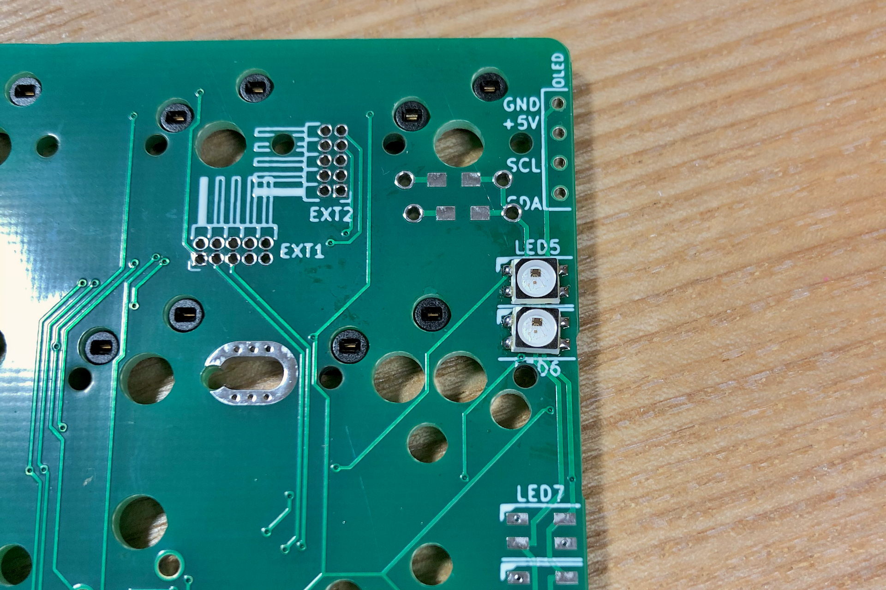
取り付けたLED

### （オプション）LEDテープの取り付け
基板裏側から`LED TAPE`へ取り付けます。

LEDテープの取り付け位置を確認し、使用する長さにカットしておきます。  
基板上の部品やソケットへの接触が心配される箇所は、絶縁のためにカプトンテープなどを貼っておきます。

基板のLEDテープ用パッドの、+5V、LED、GNDの3箇所に予備はんだしておきます。

LEDテープをパッドに重ね、端子部分をコテ先で押さえつけるようにして、真ん中のLEDパッドだけをはんだ付けします。

LEDテープがまっすぐ取り付けられていることを確認します。

残りの+5VとGNDのパッドをはんだ付けします。

テープを貼り付けます。  
テープ自体のシール部分を使わず、カプトンテープなどで貼り付けておくと、後からメンテナンスしやすいかもしれません。

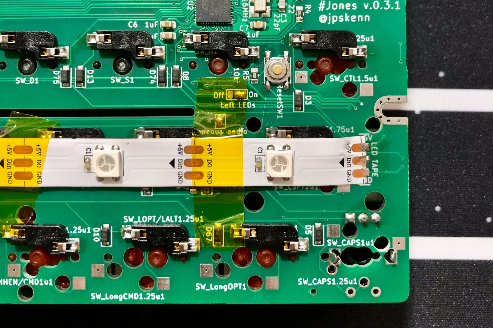  
LEDテープを取り付けた状態

#### （オプション）ロータリーエンコーダの取り付け
基板おもて面から取り付けます。

右下`SW_RE1`と左下`SW_RE2`のどちらか片方のみ、または両方へ取り付けできます。

ピンと足の位置を合わせて基板に差し込みます。  
足が差し込みにくいときは、横から少し押さえて差し込みます。

基板裏側から、何本かあるピンのうち1本だけをはんだ付けします。

ロータリーエンコーダがまっすぐ取り付けられていることを確認します。

残りのピンをはんだ付けします。


取り付けたロータリーエンコーダ（基板おもて側）


取り付けたロータリーエンコーダ（基板裏側）

### スタビライザーの取り付け
基板おもて側から取り付けます。  
なお、2U幅の左シフトキー用のスタビライザーはケースネジに干渉するため、使用には工夫が必要です。

使用するレイアウトに合わせて、スタビライザーの取り付け位置を確認します。  
スタビライザーの棒が大きい穴の側にくる方向に取り付けます。

引っ掛ける部分を斜めに差し込んで引っ掛けてから、反対側の差し込み部分を押し込みます。


取り付けたスタビライザー

### キースイッチの取り付け
キープレートおもて面からスイッチを取り付けます。

使用するレイアウトに合わせ、キープレートの4隅にスイッチをはめ込みます。  
右上は枠の切れた2箇所を避け、3番目の枠へはめ込みます。  
左下、右下にロータリーエンコーダを取り付けている場合は、その隣へはめ込みます。

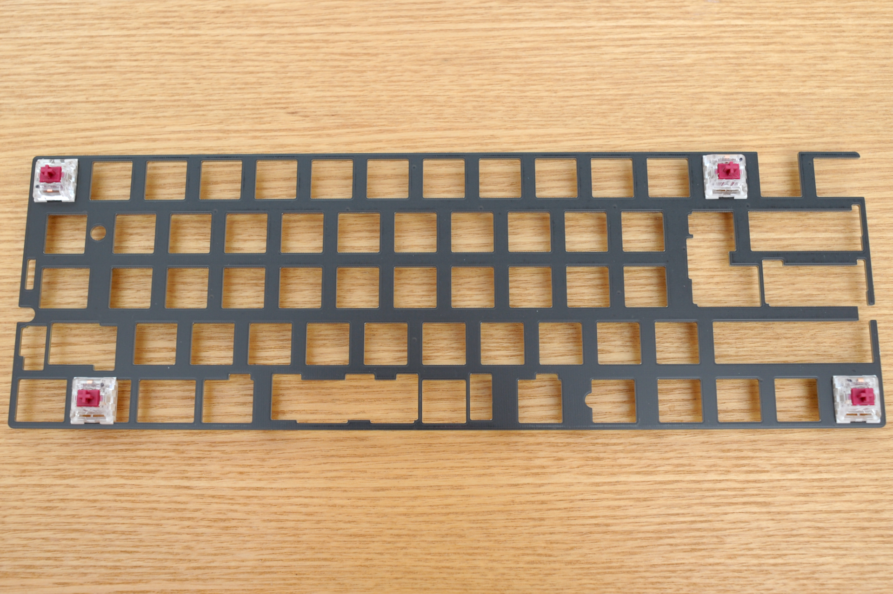
キープレート4隅につけたスイッチ

4個のスイッチをはめ込んだキープレートを、基板に合わせて乗せます。  
スタビライザーがキープレートの枠にはまるように、位置を調整します。


キープレートの枠にはまったスタビライザー（他のスイッチも取り付けた状態で撮影）

4隅のスイッチを基板のソケットに差し込みます。  
スイッチが奥まで差し込めていないときは、なるべくソケットの後ろ側を押さえながら、少しだけ力を入れて（※）押し込みます。  
※：洗濯バサミを開くよりもちょっと強いくらいの力


残りのスイッチを取り付けます。  
スイッチのピンを曲げないように気をつけます。

ソケットを使用しない箇所は、この時点でスイッチをはんだ付けします。

**注意：  
ネジ穴の上に位置するキーは、直接はんだ付けしてはいけません。  
ソケットを使用し、ネジ止めした後にスイッチを取り付けられるよう、ソケットを使用します。**

スイッチの足がケースネジ穴に干渉する箇所は、スイッチの足をカットして取り付けます。  
例えば、Hキーに5pinスイッチを使用する場合は、片方の足をカットします。  


また、ANSIスタイルの[キーは、中央の足（でっぱり部分）がネジに当たらないよう、1/4-1/3ほどカットします。  
押下時に軸がネジに当たる場合は、軸の下端をカットしてください。  


足をカットしたスイッチ  
  
左から順に  
- Gateron Silent Red 5pin：片方の足をカット
- Gateron Ink Black 5pin：片方の足をカット
- Kailh Pro Burgundy 3pin：無加工
- Gateron Ink Red 5pin：片方の足をカット、中央の足を1/3カット
- Gateron Silent Red 5pin：両方の足をカット、中央の足を全てカット


ほとんどのスイッチがこの加工で取り付けられるはずですが、うまく取り付けられないことも考えられます。  
以下の取り付け確認済みスイッチを参考にしてください。  

取り付け確認済みスイッチ：  
- Gateron Silent Red
- Gateron Silent White
- Gateron Ink Black
- Gateron Ink Red


### 動作確認
ケースへ取り付ける前に、キーボードをPCやMacに接続して動作確認を行います。

#### キースイッチの動作確認
確認の前に、実際のキーボードの配列と、OSが認識するキーボードの配列を合わせておきます。  
実際のキーボードの配列がANSIスタイルで、OSが日本語キーボードと認識しているような組み合わせや、この逆のような組み合わせのような場合は、意図した通りの入力結果になりません。  
OSの設定方法に従い、OSが認識するキーボードの配列を変更します。

確認は、OSのキーボードビューアや、[Keyboard Checker](https://keyboardchecker.com)、[QMK Configrator](https://config.qmk.fm/)の入力テスト機能を使用して行います。  
全てのキーで正常に入力できることを確認します。

なお、初めてJonesキーボードを使用する際はMac向けのキーマップに設定されているため、WindowsではALTキーとWindowsキーが逆に認識されます。  
Windows向けのキーマップには`Lower + Raise + W`を、Mac向けのキーマップには`Lower + Raise + M`を押して切り替えます。

また、LowerキーはOSで認識されないので、Lowerキーと組み合わせたキー、たとえば、`Lower + 1`の組み合わせで`F1`キーが入力できることを確認します。  

正常に入力できないキーがあった場合は、原因を調査し、修復します。

もっとも多い原因は、スイッチとソケットの取り付け不良です。  
スイッチを取り外し、ピンが曲がったり折れたりしていないか確認し、ペンチなどでピンの曲がりを修復するか新しいものに交換します。  
また、ソケットのはんだ忘れや、はんだ不良もよくある原因のため、ソケットのはんだを確認し、必要であれば再度はんだ付けします。  
スイッチをソケットへ確実に差し込み直して、もう一度キー入力ができることを確認します。

上記で解決できなかった場合、基板のソケット用パッド部分の2箇所をピンセットなどを使ってショートさせ、キー入力されるか確認します。  
キー入力された場合は、ソケットまたはスイッチに問題があるため、再度確認します。  
それでも改善されない場合は、スイッチとソケットを交換します。


ピンセットを使ってパッド部分をショートさせる

あまり考えられないことですが、パッドをショートしてもキー入力されない場合は、基板や部品へのダメージなどが原因と考えられます。  
これまでの軽微な作業ミスが原因だった場合とは異なり、原因箇所の特定にはテスターを使った詳しい調査が必要となり、修復の難易度も高くなることが予想されます。  
[Jones v.0.3.1 KiCadプロジェクト](https://github.com/jpskenn/Jones/tree/PCB_v.0.3.1/PCB)のPCB設計を参照し、パッド、ダイオード、MCUのピンなどの導通を確認して調査します。  
なお、基板製造上の問題を含む場合も疑われますので、[Twitter: @jpskenn](https://twitter.com/jpskenn/)へご一報いただければ、何か情報共有できるかもしれません。

#### ロータリーエンコーダの動作確認

ロータリーエンコーダのつまみを回し、OSの音声出力ボリュームが変化することを確認します。  

また、プッシュボタンスイッチ付きのロータリーエンコーダでは、プッシュするとOSの音声出力がミュート／ミュート解除されることを確認します。

デフォルトのキーマップでは、左下、右下ともに、同じ機能が割り当てられています。

動作不良の場合は、はんだ付けをやり直してください。


#### LEDの動作確認

右側2個のLEDが点灯（Mac向けのキーマップでは白色、Windows向けのキーマップでは青色）していれば正常です。

左側とLEDテープは`Lower + Raise + L`で点灯オン／オフが切り替わり、全て点灯していれば正常です。

光らない箇所がある場合は、次の法則にしたがって調査、修復します。

LEDは`左側の上から下　→　右側（2行目または3行目）の上から下　→　LEDテープ`の順に並んでおり、取り付け不良のLEDより先は光らない。  
また、取り付け不良のLEDには以下の2パターンあります。  
A. そのLED自体のはんだ不良のため光らない  
B. そのLEDから次のLEDへつながる端子だけはんだ不良のため光らない

次の例は、どちらも光るLEDは同じですが、不良箇所が異なることに注意してください。  
例1：右側の2個目がパターンAの取り付け不良だった場合、左側4個と右側の1個目だけ光り、右側2個目とLEDテープは光らない。  
例2：右側の1個目がパターンBの取り付け不良だった場合、左側4個と右側の1個目だけ光り、右側2個目とLEDテープは光らない。

以上をふまえ、  
先頭から数えて最初の光らないLEDについて、
光っていないLED自体のはんだをやり直して、点灯するかどうか確認し、  
点灯しない場合は、一つ手前のLEDのはんだをやり直して、点灯するか確認する  
という調査、修復をおこないます。

220-270℃で1、2と数える程の加熱ではそう簡単にはLEDは壊れないと考えますが、何度かはんだをやり直しても点灯しない場合は、LEDが壊れていると判断して新しいものに交換します。

主なLED関連キーは次の通りです。

    Lower + Raise + L  LED点灯のオン／オフ
    Lower + Raise + Lの右隣のキー（;）　次の点灯モードに切り替え
    Lower + Raise + P　前の点灯モードに切り替え
    Lower + Raise + I　LEDの輝度増加
    Lower + Raise + K　LEDの輝度低下


#### スピーカーの動作確認
キーボードとPCやMacを接続した際、♪ピロリロという音が鳴っていれば確認OKです。

音が鳴らない場合は、スピーカーのはんだ付けをやり直します。

主なスピーカー関連キーは次の通りです。

    Lower + Raise + A　スピーカーのオン／オフ切り替え
    Lower + Raise + S　タイプ音のオン／オフ切り替え
    Lower + Raise + A　ミュージックモードのオン／オフ切り替え


### （該当者のみ）60% プラスチックケースの加工

60% プラスチックケースへ取り付ける際は、ネジ穴と同じ高さのケース内リブが基板上の部品と干渉するため、以下の加工を行います。

#### 干渉箇所のカット
カットする箇所を確認します。  
次の場所の、ケースネジ穴と同じ高さになっているリブです。  
- 左の上側ネジの上下。
- 右の上側ネジの上下。
- ケース一番下の長いリブのうち、ソケットに当たる部分。  
（スイッチが上下逆向きになって、ソケットが下側に来ている箇所）

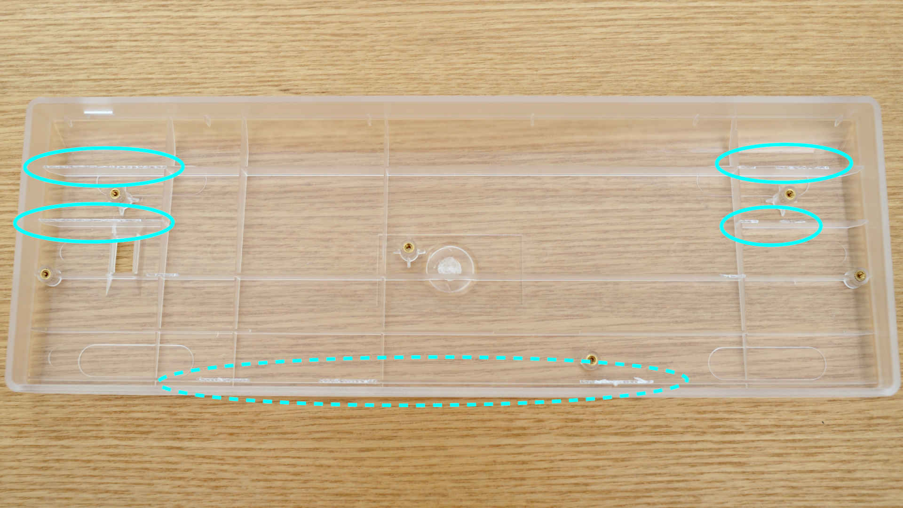
カット箇所


カット例、左の上側ネジの上下


カット例、一番下の長いリブ

写真で示した部分を、ニッパーやカッターなどを使ってカットします。  
ニッパー使用時は、1-2mmくらいずつ切り進んでいきます。  
それ以上の長さをカットすると、意図しないところまで割れてしまうことがあります。

### ケースへの取り付け

取り付け前に、Hキーなどのネジ穴にかぶさるスイッチを外しておきます。

基板の奥側（USBコネクタ側）からケース内へ入れていきます。  
ケースに対して基板を30度くらいの角度で差し込むと、USBコネクタがケースの穴にスッとはまります。  
その状態で基板の手前側をおろして水平にすると、力をかけることなく、基板全体がストンとケースに入ります。  
力を入れてグリグリとこじったり、ググググッと押し込むようなことはせず、角度を合わせて差し込むだけです。


30度で差し込む

ケースネジ穴と基板のネジ穴の位置を合わせ、ネジで仮止めします。  

基板が上下左右の真ん中になるように位置を調整します。

左の上側のネジを固定してから、残りのネジを固定します。  
スイッチがかぶさる箇所は低頭ネジを使用します。  
なお、左右の4箇所だけネジ止めして、中央と中央下をネジ止めせずに使用しても特に問題ありません。

取り外してしていたスイッチを取り付けます。


### 仕上げ

PCやMacに接続し、各部の動作を簡単に確認しておきます。

ケース底面に滑り止めのクッションパッドを貼り付けます。  
60% プラスチックケースに付属するパッドが貼り付け部分よりも大きいときは、ハサミなどでカットして貼り付けます。

ロータリーエンコーダのノブを取り付けます。

キーキャップを取り付けます。

完成です。

写真を撮影し、`#Jones_kbd` のタグをつけてツイートすると設計者が喜んだりします。  
[Twitter: #Jones_kbd](https://twitter.com/search?q=%23Jones_kbd)
