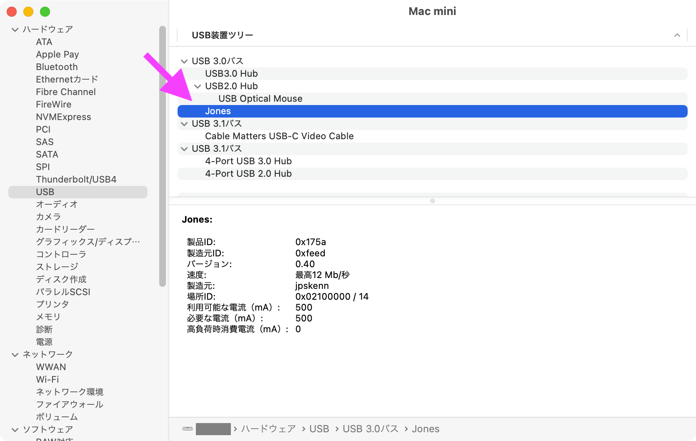
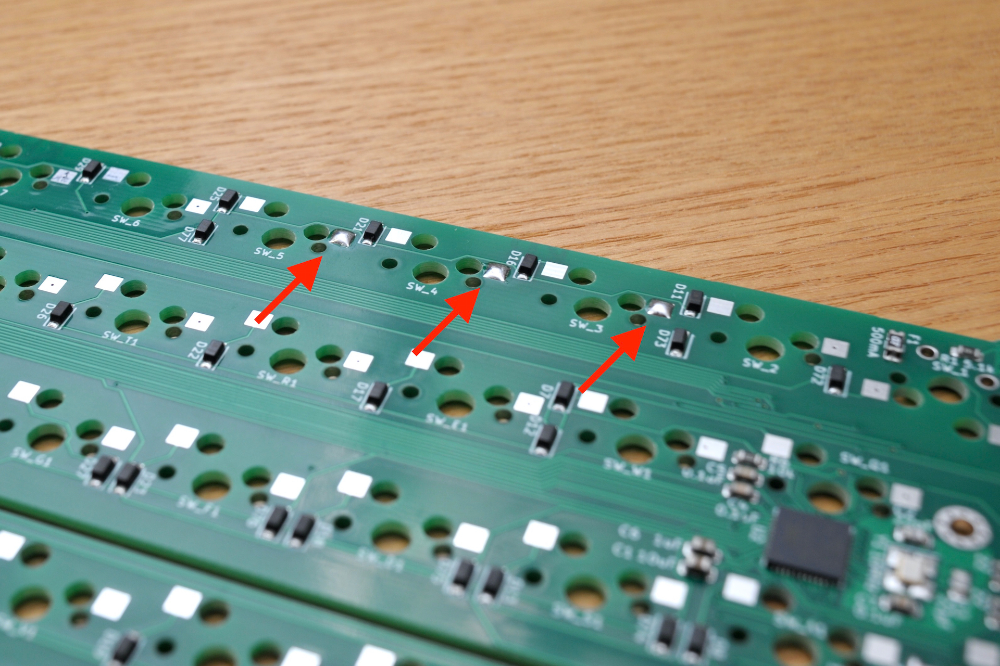
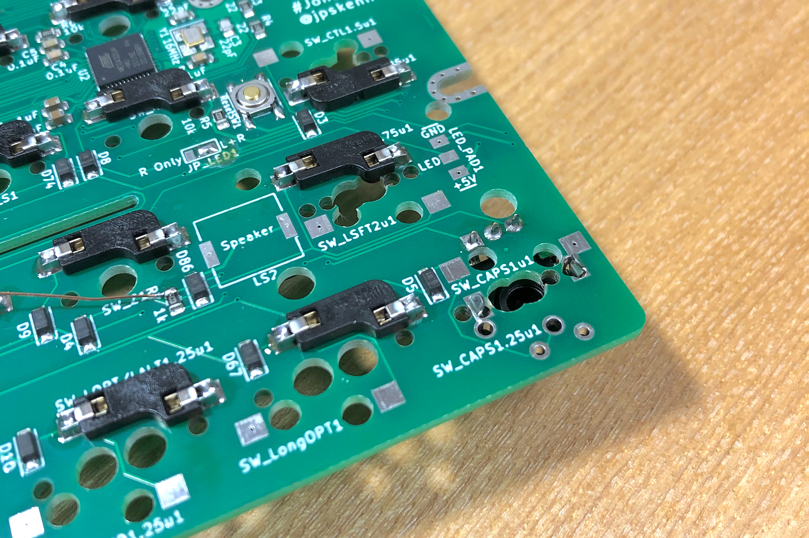
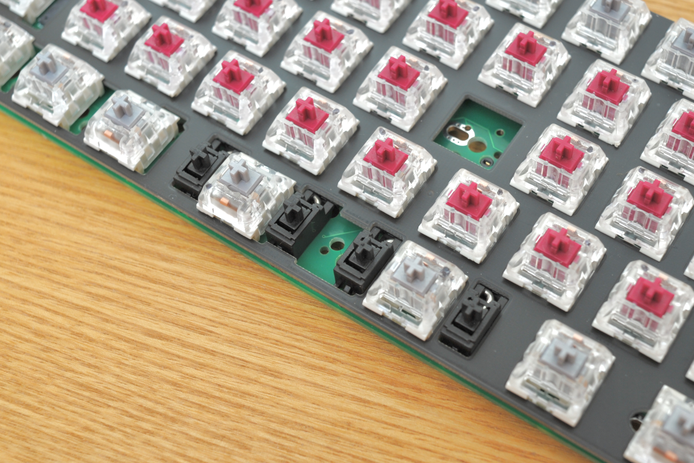
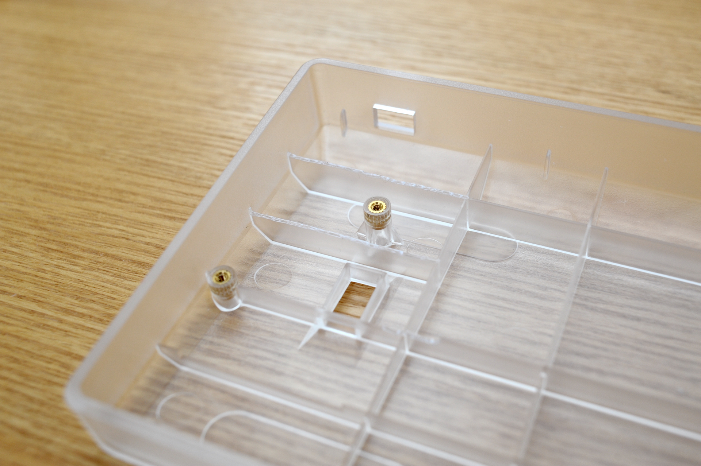
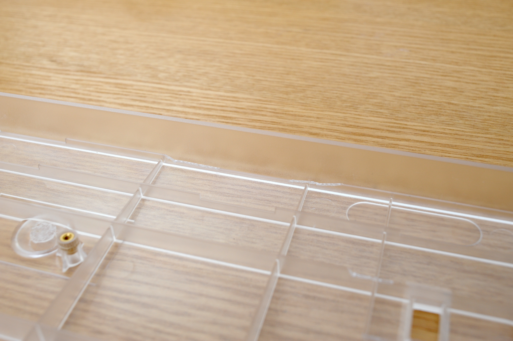
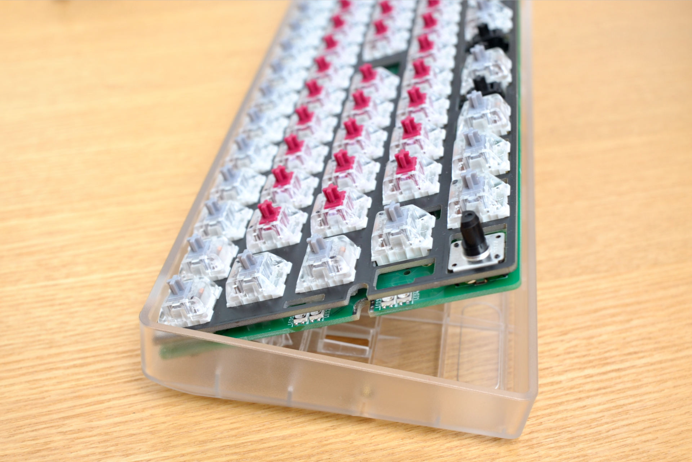
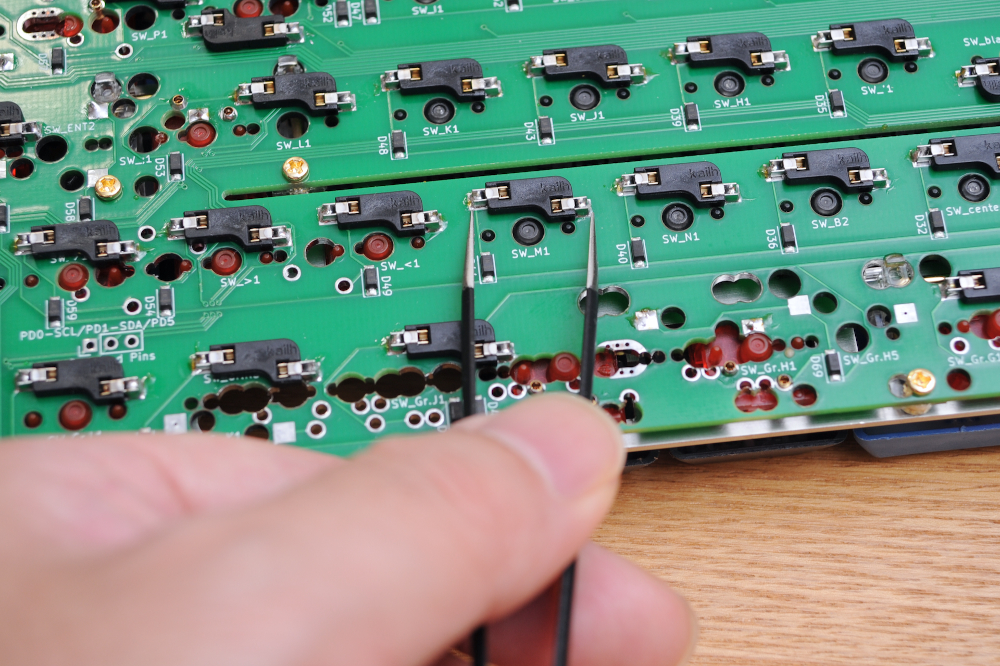

# Jones v.0.4.x ビルドガイド

購入していただいた方、リポジトリから製造していただいた方、その他の皆様、Jonesに興味を持っていただきありがとうございます。

このドキュメントは、Jones v.0.4.xを組み立てるためのビルドガイドです。  
Jonesのコンセプトや特徴などについては、[Jones README](https://github.com/jpskenn/Jones/blob/master/README.md)をご覧ください。

ビルドガイド全体に目を通して作業手順を把握しておくとミスの防止につながりますので、ぜひ、一度お読みになってから組み立て作業を始めてください。

## 目次

## 注意事項、制限など

### キースイッチ取り付け時の加工

ケースのネジ穴とスイッチ足の干渉を避けるため、中央ネジ穴の上に位置するスイッチは足を加工して取り付けます。

また、Narrowレイアウトを使用する際は、右上ネジ穴の上に位置するスイッチも、足を加工して取り付けます。

### キースイッチの取り付け方向

一部のキーは上下逆向きや横向きに取り付けるため、キーキャップが取り付けにくかったり、キーキャップとスイッチが干渉し打鍵感が悪くなることがあります。

### 左シフトキースタビライザー

左シフトキーの2Uスタビライザーは、ケースネジに干渉するため使用を避けてください。

### スピーカー

スピーカーは、左シフトキーが1.75uまたは2uの場合にのみ取り付けることができます。

### ケース

GH60型, Poker型に対応する基板とキープレートですが、もしかしたら取り付けできないケースがあるかもしれません。  
取り付け確認済みのケースは次の通りです。

- [KBDfans TOFU 60% ALUMINUM CASE](https://kbdfans.com/products/kbdfans-tofu-60-aluminum-case)

- [KBDfans 5° FROSTED ACRYLIC CNC 60% CASE](https://kbdfans.com/products/pre-order-kbdfans5-transparent-acrylic-cnc-60-case)

- [60% プラスチックケース](https://yushakobo.jp/shop/60-plastic-case/)（簡単な加工が必要）

上記以外のケースへの取り付けの成功／失敗の報告を募集しております。

## 部品リスト

このキットを組み立てるためには、”キット内容物”に加え、”別途用意が必要な部品”が必要です。  
好みに合わせて必要な数をお買い求めください。

”オプション部品”は使いたい機能などに合わせて用意してください。  

### キット内容物
〓説明・写真更新〓
〓小物類は同じ写真にすべて置いて、それぞれに◯をつける
| 部品名 | 個数 | 備考 |
| ----- | :-----: | ----- |
| ご案内リーフレット | 1 | |
| Jones 基板 v.0.4.x | 1 | [おもて側 ](../assets/BuildGuide_v.0.3.1/DSC_6972.jpeg) [裏側 ](../assets/BuildGuide_v.0.3.1/DSC_6972.jpeg) |
| Jones キープレート v.4.0.x | 1 | [おもて側 ](../assets/BuildGuide_v.0.3.1/DSC_6972.jpeg) |
| Kailh MXソケット | 75(\*) |  |
| 低頭ネジ, M2 4mm | 3(\*) |  |
| 低頭ネジ, M2 5mm | 3(\*) |  |
| プラ板, 5mm\*40mm | 1 |  |
| ナット, M1.4 | 4 |  |

\* 予備を含む

### 別途用意が必要な部品

| 部品名 | 個数 | 備考 |
| ----- | :-----: | ----- |
| MXスイッチ | 最大 70 | 取り付け安定性が高い5pinを推奨 |
| PCBマウント スタビライザー：2Uサイズ | 2U以上のキー数 | 確実に固定できるねじ止め式を推奨 |
| キーキャップ | 必要数 | |
| ケース（GH60型, Poker型） または Jones用ボトムプレートキット(\*) | 1 | |
| USBケーブル （Type-C） | 1 | |

\* Jones用ボトムプレートキットの内容物は次の通り
| 部品名 | 個数 | 備考 |
| ----- | :-----: | ----- |
| ご案内リーフレット | 1 ||
| Jones用ボトムプレート | 1 | [おもて側 ](../assets/BuildGuide_v.0.3.1/DSC_6972.jpeg) [裏側 ](../assets/BuildGuide_v.0.3.1/DSC_6972.jpeg) |
| スペーサー, M2 3mm | 8 |  |
| ネジ, M2 3mm | 16 |  |
| ゴム足 大 | 2 |  |
| ゴム足 小 | 6 |  |

### オプション部品

| 部品名 | 個数 |
| ----- | :-----: |
| LED SK6812MINI | 2 または 4 |
| ロータリーエンコーダ, ノブ（つまみ） ALPS EC11, ALPS EC12またはその互換品 | 最大 2 | ロータリーエンコーダ |
| スピーカー Murata PKMCS0909E4000-R1 | 1 | スピーカー |

## 組み立てに必要な工具

先の小さなドライバー、ピンセット、はんだ付け関連用品など、一般的な電子工作向け工具を使用します。  
[遊舎工房の工具セット](https://yushakobo.jp/shop/a9900to/)を参考に用意してください。

また、キースイッチの取り外し用の工具も用意してください。  
[TALP KEYBOARDさんで売っているこのタイプ](https://talpkeyboard.net/items/601362fe2438601925ad0692)は、1本でキースイッチとキーキャップの両方に使えるので便利です。

なお、無くても組み立てはできますが、何か不具合があった場合の原因究明のため、テスターを用意しておくと安心です。

## 組み立て前の確認

組み立てを開始する前に、同梱物と基板についての基本的な確認をおこないます。  
何か問題があった場合は作業を中止し、キット同梱のリーフレットに記載された連絡先へ問い合わせてください。

*組み立て手順の開始後は初期不良として対応できかねる場合がありますので、しっかりと確認してください。*

### 同梱物の確認

- 同梱物に不足がないこと

- 基板に配線が切れるような大きく深い傷や割れなどの破損がないこと

- 梱包の中に小さな部品が落ちていないこと（基板に実装された部品の剥がれ落ち）

### 接続の確認

MacやPCに接続した際に、キーボードとして認識されるかを確認します。

ファームウェアを書き込み済みですので、正常であれば、USBケーブルで接続するとキーボードとして認識されます。  
下記の方法を参考に確認してください。

#### Mac, macOS Big Sur 11.4

*充電用ではないUSBケーブル*（できれば他の機器を接続して使用した実績のあるもの）を使って、キーボードとMacをUSB接続します。

メニューバーから、``　→　`このMacについて`を選び、表示された画面で`システムレポート…`をクリックします。  
システム情報が表示されたら、左側の`ハードウェア`から`USB`を選択します。

右側の`USB装置ツリー`に`Jones`というデバイスが表示されていれば、正しく認識されています。

  
システム情報の表示

#### Windows, 10 Pro 1909(18363.1082)

*充電用ではないUSBケーブル*（できれば他の機器を接続して使用した実績のあるもの）を使って、キーボードとPCをUSB接続します。

`スタートボタン`から`設定`を開いて`デバイス`を選択し、  
`マウス、キーボード、ペン`の項目に`Jones`が表示されていれば、正しく認識されています。

  
デバイスの表示

### ソケット用パッドの確認

〓この手順はパス

キースイッチのソケットをはんだ付けするソケット用パッドが、電気的に正しく反応するかを確認します。

キーレイアウトを見ながら全ての組み合わせが確認できるので、Remapを使って確認するのがおすすめです。

他にも、OSのキーボードビューアや、[Keyboard Checker](https://keyboardchecker.com)、[QMK Configrator](https://config.qmk.fm/)のキーボード入力テストを使用して確認することもできます。

#### Remapを使った確認方法

基板の裏面が上側になるように置き、PCやMacとUSBケーブルで接続します。

Google Chromeブラウザ（バージョン89以降のWeb HIDに対応したもの）で、[Remap](https://remap-keys.app/)を開きます。

`START REMAP FOR YOUR KEYBOARD`をクリックしてキーボード接続画面に進みます。

`+ KEYBOARD`をクリックし、ポップアップ画面を開き、  
`Jones`を選択して`接続`をクリックすると、画面にレイアウトが表示されます。

レイアウト右側の`…`をクリックし、`Test Matrix mode`を選択します。

ピンセットなどの電気を通すものを使い、基板裏面のソケット用パッドをショートさせます。
〓写真

Remapの画面で、ショートさせたパッドに対応するキーの色が変わることを確認します。  
〓写真

ソケット用パッドを順にショートさせ、全てのキーの色が変わることを確認します。

また、レイアウト右側の`Layout Option`アイコンをクリックし、他のレイアウトでも同様に確認します。

#### キー入力による確認方法

ソケット用パッドをショートして、実際に入力された結果を確認します。

〓書く〓

## 組み立て手順

以下の手順に沿って組み立ててください。

### スイッチ用ソケットの取り付け

基板裏側へソケットを取り付けます。

#### 取り付け位置の確認

使用するレイアウトに合わせて、基板裏側のソケットの取り付け位置を確認します。  
レイアウトは[Keyboard Layout Editor: Jones v04_1](http://www.keyboard-layout-editor.com/#/gists/ab35444150ef1aff63ed32bbe2b9a1ef)を参考にしてください。

基板にはソケットの枠が描かれており、1uよりも大きなキーと、ソケットが重なる箇所に適合キーサイズ（1uや2uなど）が表記されています。  
また、キーサイズの表記に`N`がついてものはNarrowレイアウトのみで使用するキーを意味していますので、それらの表記を参考に取り付け位置を確認します。  
わかりにくいときは、実際にスイッチやキーキャップを置いてみるとよいでしょう。
〓写真追加、サイズ表記、N表記〓

#### 予備はんだとソケットの設置

先ほど確認したソケット用パッドの*片方だけ*に予備はんだ（はんだをちょっとつけておく）する手順です。

聞き手にはんだごて、もう一方の手にはんだを持ちます。

パッドにこて先をあてて、1、2、と数えて加熱します。

こて先にはんだをあてて溶かし、  
溶けたはんだがパッド全体に広がったらはんだを離し、  
続いてこて先をパッドから離します。

<!-- 〓販売版で写真更新〓 -->

ソケット用パッドへの予備はんだ

ソケットを基板に描かれた枠に合わせ、プラスチックの突起が穴にはまるように仮置きします。  
この段階では、片方の端子が予備はんだの上に乗り、基板からソケットが少し浮いて傾いた状態です。

〓写真追加、ソケット仮置き〓

スイッチ中央の穴をソケットでふさがない方向で置かれていることを確認します。

<!-- 〓販売版で写真更新〓 -->

ソケットの方向

#### 予備はんだした端子のはんだ付け

利き手にはんだごて、もう一方の手にピンセットを持ちます。

はんだごてを320℃程度に設定します。

ピンセットでソケット中央のプラ部分を押さえ、端子の隙間にこて先を押し込みます。

〓写真更新、ピンセットで押さえてるのも入れる〓

金属部分へコテ先を押し込む

1、2と数えたくらいで予備はんだが溶け始めます。  
ソケットを押さえていたピンセットを軽く押し込むと、ソケットのプラスチックの突起が基板の穴にはまり、浮いていた端子が基板に接します。

端子とパッドをしっかりと加熱するため、端子が基板に接してから、1、2と数えてこて先を離します。  
さらに1、2と数えて、はんだが固まるのを待ってから、ソケットを押さえていたピンセットを離します。

ソケットが枠に沿ってまっすぐに取り付けられ、傾いていないことを確認します。  
傾いている場合は端子部分を再加熱し、こて先とピンセットで傾きを修正します。
〓写真追加、ソケットの傾き〓

### 残りの端子のはんだ付け

利き手にはんだごて、もう一方の手にはんだを持ちます。

残りの端子の隙間にこて先を押し込み、1、2　　と数えて加熱します。

次の手順を、1、2、3、4と数える間におこないます。

1、基板のパッドと端子の隙間あたりへはんだを押しつけます。
2、はんだを溶かしながら隙間へ流し込みます。  
3、溶けたはんだがパッド全体に広がる程度まで流し込んだら、はんだを離します。  
4、ソケットを動かしてしまわないよう、静かにこて先を離します。

はんだがパッド全体に広がり、端子の間にポコっと盛り上がって固まっているのが良好な状態です。

〓写真、はんだの状態。NGとしてはんだの足りないものも載せる

ソケットが枠に沿ってまっすぐに取り付けられていることと、プラスチックの突起が基板の穴にぴったりとはまり、基板から浮いていないことを確認します。  

<!-- 〓販売版で写真更新〓 -->

取り付けたソケット〓NGの浮いてるのも載せる

#### すべてのソケットの取り付け

作業を繰り返して、すべてのソケットを取り付けます。

取り付けが終わったら、**はんだ付けし忘れた箇所がないか、十分に確認します**。

特に`残りの端子のはんだ付け`を忘れることがよくあります。  
キー入力できたり、できなかったり、ケースに入れたらキーが反応しなくなったりするなどの症状が出るため、この段階でよく確認しておきます。

### （オプション）インジケータLEDの取り付け

*インジケータLEDを使用しない場合、この手順は不要です。*

基板裏側でジャンパし、おもて側へLEDを取り付けます。

#### インジケータLEDの組み合わせとジャンパの設定

LED未使用も含めて4通りの組み合わせがあります。  

| 組み合わせ | 左側 LED1, 2 | 右側 LED3, 4 | ジャンパ Left LEDs | ジャンパ Right LEDs |
| :--: | :--: | :--: | :--: | :--: |
| LED未使用 | なし | なし | 不要 または Off | 不要 または Off |
| 左側のみ | あり | なし | On | 不要 または Off |
| 右側のみ | なし | あり | Off | On |
| 左右両方 | あり | あり | On | On |

#### ジャンパ

基板裏側のジャンパ`Right LEDs`と`Left LEDs`を、インジケータLEDの組み合わせに応じて`On`または`Off`にジャンパ（パッドにはんだをつけてつなげる）する手順です。  
`不要 または Off`となっている箇所は、ジャンパしなくてもかまいません。

〓写真追加、基板裏面全体で、左右のパッド位置を矢印とか○で囲んだりしたもの〓

3個あるパッドのうち、中央と`On`の2個、または中央と`Off`の2個を同時に温め、  
こて先にはんだを押し付けて、少したっぷり目に溶かし、  
こて先を、基板をなでるようにスッと横へずらしてパッドから離し、2個のパッドをはんだでつなげます。

最初のうちはうまくつなげられないことが多いですが、はんだをチョンチョンとつけたりしていると、そのうちつながります。  
はんだをつけすぎて、3個あるパッドがすべてつながってしまわないように気をつけてください。
また、こて先でパッドをグリグリいじりすぎると基板からパッドが剥がてしまうため、こて先はパッドにそっと乗せて温めて、スッと横へずらすだけにしてください。

〓写真追加、どこかをジャンパした状態〓

#### 予備はんだ

基板おもて側から、インジケータLEDの組み合わせに応じた取り付け場所を確認します。

LED1個につき4箇所のパッドがあり、そのうち1箇所だけに予備はんだします。  
スイッチソケット用のパッドに比べてLEDのパッドはとても小さいため、はんだをつけすぎないようにします。

<!-- 〓販売版で写真更新〓 -->

LED取り付け方向を示す縦線とLEDの方向、LED5およびLED6へ予備はんだした状態

#### LEDの仮固定

▲マークが設置方向を示す縦線〓三角？〓に合うように、LEDを基板に置きます。  
この段階では、LEDが予備はんだした箇所に乗り、基板から少し浮いています。

〓写真、LEDの設置方向〓

LEDは高温ではんだ付けすると壊れるため、こて先温度を220-270℃に設定します。  
使用するはんだの種類や加熱時間にもよりますが、220℃では加熱不足によるはんだ不良（表面上ははんだ付けされたように見えるが、内部はしっかりとくっついていない状態）に注意してください。  
[加熱不足による、はんだ不良の例](https://twitter.com/jpskenn/status/1291328876283478016)

フラックスを予備はんだに塗っておくと、作業しやすくなります。

ピンセットでLEDをつまみ、位置がずれないように保持します。

はんだごてのこて先を、LEDの横方向からパッドとLEDの端子にあてて、予備はんだを溶かします。  
予備はんだが溶けたら、LEDが設置位置の中心に来るようにピンセットで位置を微調整し、1、2と数えてこて先を離します。  
さらに1、2と数えて、はんだが固まったらLEDをつまんでいたピンセットを離します。  

はんだが、直径1mmくらいの小さな球のようになっていれば良い仕上がりです。

LEDの取り付け位置が大きくずれていたり基板から浮いている場合は、はんだ付けした箇所を再加熱し、ピンセットで修正します。  
再加熱する際も、フラックスを塗っておくと作業がしやすくなります。

#### LEDの取り付け

次の順番で残り3箇所のパッドをはんだ付けします。

1. 予備はんだしたパッドとLEDの発光部を挟んだ反対側のパッド

1. 1の隣のパッド

1. 残ったパッド（予備はんだしたパッドの隣）

〓写真、取り付け順序〓

フラックスを残り3箇所のパッドに塗っておくと、作業しやすくなります。

はんだをこて先にあてて溶かし、少量のはんだをこて先につけます。  
こて先をパッドとLED側面の端子に軽く押しあてて、1、2と数えてこて先を離します。

はんだが、直径1mmくらいの小さな球のようになっていれば良い仕上がりです。

<!-- 〓販売版で写真更新〓 -->

取り付けたLED

作業を繰り返し、必要な数のLEDを取り付けます。

### （オプション）スピーカーの取り付け

*スピーカーを使用しない場合、この作業は不要です。*  
*なお、スピーカーは、左シフトキーが1.75uまたは2uの場合にのみ取り付けることができます。*

基板おもて側にスピーカーを取り付けます。

基板おもて側、`Speaker`のパッド2箇所のうち、1箇所だけに予備はんだしておきます。

スピーカーを枠とパッドに合わせて置きます。  
スピーカーの端子に極性はないため、どちらの方向に取り付けても大丈夫です。  
〓右か左か知りたい〓スピーカーの穴がキープレートの空き部分にくるような方向に取り付けると音が聞こえやすくなります。

予備はんだした箇所の端子をはんだ付けします

スピーカーがまっすぐ取り付けられていることを確認します。

残りの1箇所をはんだ付けします。

取り付けたスピーカー

### （オプション）ロータリーエンコーダの取り付け

*ロータリーエンコーダを使用しない場合、この作業は不要です。*

基板おもて側からロータリーエンコーダ（ALPS EC11, ALPS EC12とその互換品）を取り付けます。  
取り付け確認済みのロータリーエンコーダは次の通りです。

- ALPS EC11E09244AQ
- ALPS EC11E153440D
- ALPS EC11E18244AU
- ALPS EC12E24204A2
- Bourns PEC11R-4315F-S0012
- Bourns PEC11R-4015F-S0024

右下と左下のどちらか片方、または両方へ取り付けできます。  
なお、キースイッチとは排他取り付けとなります。

〓写真、全体で取り付け位置を示したもの〓

ロータリーエンコーダのピン（上3本, 下2本（\*））と、左右の固定足を、基板の設置位置に合わせて差し込みます。  
固定足が差し込みにくいときは、足を横から少し押さえ、先端を基板の穴に入れます。  
\* プッシュボタン付きの場合のみ

左右の固定足である程度しっかりと基板に固定されるはずですが、固定がゆるく、基板から外れたり浮いたりする場合はマスキングテープなどで仮固定します。

基板を裏側が上になるように置き、上3本、下2本のピンのうち*1本だけ*をはんだ付けします。

ロータリーエンコーダが基板に描かれた枠に沿ってまっすぐ取り付けられていることを確認します。

ロータリーエンコーダが基板から浮かないように気をつけながら、残りのピンをはんだ付けします。

<!-- 〓販売版で写真更新〓 -->

取り付けたロータリーエンコーダ（基板おもて側）

<!-- 〓販売版で写真更新〓 -->

取り付けたロータリーエンコーダ（基板裏側）

### スタビライザーの取り付け

#### スタビライザーの組み立て

次のようにスタビライザーを組み立てます。
〓主に写真だけ〓

#### スタビライザーの取り付け位置の確認

使用するレイアウトに合わせて、スタビライザーの取り付け位置を確認します。  
なお、左シフトキーの2uスタビライザーは、ケースネジに干渉するため使用を避けてください。

〓写真：取り付け位置〓

#### スタビライザーの基板への取り付け

基板おもて側から、スタビライザーの棒が大きい穴の側にくる方向に取り付けます。

〓写真：取り付け方向〓

引っ掛ける部分を斜めに差し込んで引っ掛けてから、反対側の差し込み部分を押し込んで取り付けます。

取り付けたスタビライザー

#### 左スペースキーのスタビライザーがゆるい場合

左スペースキーのスタビライザーは2u用と2.25u用のものが並んでいるため、取り付けが横方向にゆるい場合があります。  
このような場合は、キット付属のナット（M1.4）をゆるみ防止に使用してください。

左スペースキーのスタビライザーを、通常通りに取り付けます。

スタビライザーをつけない方の大きい穴に、基板の裏側からマスキングテープを貼ります。

キット付属のナット（M1.4）1個を、スタビライザーの大きい穴にはめこみます。  
スタビライザーとの間に隙間があるようなら、ナットにマスキングテープを巻いて隙間が埋まるように調節します。

基板のおもて側からマスキングテープを貼って、ナットを止めます。
〓一連の写真〓

### スイッチの取り付け

スイッチを、キープレートを介して基板に取り付けます。

#### スイッチ取り付け前の確認

スイッチの端子を見て、折れたり、曲がったりしていないことを確認します。  
少しだけ曲がっているものは、まっすぐに戻します。

折れてしまっているものは使用できません。  
また、大きく曲がっているものは、まっすぐに戻しても折れやすくなっているため、使用を避けてください。

〓写真：端子曲がり〓

#### キープレートの取り付け

キープレートをおもて側が上になるように置きます。

使用するレイアウトに合わせ、キープレートの4隅にスイッチをはめ込みます。  
ロータリーエンコーダを取り付けている場合は、その隣へはめ込みます。

スイッチの取り付け方向がソケットの方向に合うようにしてください。  
例えば、左上のキーは上下逆向きにはめ込みます。

キープレート4隅につけたスイッチ

スイッチがキープレートの枠にぴったり密着してはまっていることを確認します。
〓写真、スイッチのはまり具合。OKとNG

基板を表側が上になるように置きます。

4隅にスイッチをはめ込んだプレートを基板に乗せ、スイッチの端子とソケットの位置を合わせます。
スタビライザーが取り付けてあるときは、キープレートの枠にはまるように位置を調整します。

キープレートの枠にはまったスタビライザー

4隅のスイッチを、1個ずつ基板のソケットに押し込んでいきます。  
スイッチの端子が奥まで差し込めるように、基板裏側のソケットを押さえながら、少しだけ力を入れて（\*）スイッチを押し込みます。  
※：洗濯バサミをつまんで開くよりも、もう少し強いくらいの力。

#### ケースネジ穴に干渉するスッチの取り付け

ケースのネジ穴とスイッチ足の干渉を避けるため、スイッチの足を加工して取り付ける箇所があります。

##### 中央ネジ穴の上に位置するスイッチ, Gの右隣のキー

すべてのレイアウトで、中央ネジ穴の上に位置するスイッチは、スイッチの足を加工して取り付けます。

5pinスイッチは、中央ネジ穴と干渉する片方の足を、ニッパーなどで切断して取り付けます。  

3pinスイッチは干渉しないため、そのまま取り付けできます。

5pinスイッチの片方の足を切断

##### 右上ネジ穴の上に位置するスイッチ, Narrowレイアウトの、上から2行目、右から2個目のキー

Narrowレイアウトを使用する際は、右上ネジ穴の上に位置するスイッチも足を加工して取り付けます。

5pinスイッチ、3pinスイッチのいずれも、スイッチ中央の足（出っ張り）を、ネジ穴に当たらない程度に一部切断して取り付けます。  
中央の足をすべて切断しても良いですが、スイッチ固定の安定性が下がります。  
中央の足の1/4〜1/3に切り込みを入れてから一部だけ切断する方がおすすめです。

中央の足の1/4くらいに切り込みを入れる

中央の足の一部だけを切断する

なお、押下時にスイッチの軸がネジに当たる場合は、軸の下端を少しだけ切断します。

〓写真：軸の下端をカット〓

#### 残りのスイッチの取り付

スイッチの取り付け方向がソケットの方向に合うようにして、残りのスイッチを取り付けます。

スイッチの端子が曲がらないよう、真上からまっすぐに押し込みます。

取り付けたら、スイッチがキープレートの枠にぴったりとはまっていることを確認します。  
スイッチがキープレートから浮いているような場合は、プレートを指で引っ張り、スイッチと密着させます。

### 動作確認

ケースへ取り付ける前に、キーボードをPCやMacに接続して動作確認を行います。

#### スピーカーの動作確認

USBケーブルで接続した際、`♪ピッ`という音が聞こえることを確認します。

音が聞こえない場合は、`左スペース` `右スペース` `A`を同時に押して、スピーカー機能のON/OFFを切り替えます。  
切り替えた時に`♪ピロッ`という音が聞こえることを確認します。

それでも音が聞こえない場合は、スピーカーが正しくはんだ付けされているか確認します。

#### スイッチの動作確認

〓Remapなテスト。テスト前にレイアウト合わせてから〓

正常に入力できないスイッチがあった場合は、〓リンク〓参考：正常に入力できないスイッチの原因調査方法の手順に沿って調査します。

#### ロータリーエンコーダの動作確認

ロータリーエンコーダのつまみを回し、OSの音声出力ボリュームが変化することを確認します。  

また、プッシュボタンスイッチ付きのロータリーエンコーダでは、プッシュするとOSの音声出力がミュート／ミュート解除されることを確認します。

デフォルトのキーマップでは、左下、右下ともに、同じ機能が割りあてられています。

動作不良の場合は、はんだ付けをやり直してください。

#### LEDの動作確認

右側2個のLEDが点灯（Mac向けのキーマップでは白色、Windows向けのキーマップでは青色）していれば正常です。

左側とLEDテープは`Lower + Raise + L`で点灯オン／オフが切り替わり、全て点灯していれば正常です。

光らない箇所がある場合は、次の法則にしたがって調査、修復します。

LEDは`左側の上から下　→　右側（2行目または3行目）の上から下　→　LEDテープ`の順に並んでおり、取り付け不良のLEDより先は光らない。  
また、取り付け不良のLEDには以下の2パターンあります。  
A. そのLED自体のはんだ不良のため光らない  
B. そのLEDから次のLEDへつながる端子だけはんだ不良のため光らない

次の例は、どちらも光るLEDは同じですが、不良箇所が異なることに注意してください。  
例1：右側の2個目がパターンAの取り付け不良だった場合、左側4個と右側の1個目だけ光り、右側2個目とLEDテープは光らない。  
例2：右側の1個目がパターンBの取り付け不良だった場合、左側4個と右側の1個目だけ光り、右側2個目とLEDテープは光らない。

以上をふまえ、  
先頭から数えて最初の光らないLEDについて、
光っていないLED自体のはんだをやり直して、点灯するかどうか確認し、  
点灯しない場合は、一つ手前のLEDのはんだをやり直して、点灯するか確認する  
という調査、修復をおこないます。

220-270℃で1、2と数える程の加熱ではそう簡単にはLEDは壊れないと考えますが、何度かはんだをやり直しても点灯しない場合は、LEDが壊れていると判断して新しいものに交換します。

主なLED関連キーは次の通りです。

    Lower + Raise + L  LED点灯のオン／オフ
    Lower + Raise + Lの右隣のキー（;）　次の点灯モードに切り替え
    Lower + Raise + P　前の点灯モードに切り替え
    Lower + Raise + I　LEDの輝度増加
    Lower + Raise + K　LEDの輝度低下

### （該当者のみ）60% プラスチックケースの加工

60% プラスチックケースへ取り付ける際は、ネジ穴と同じ高さのケース内リブが基板上の部品と干渉するため、以下の加工を行います。

#### 干渉箇所のカット
カットする箇所を確認します。  
次の場所の、ケースネジ穴と同じ高さになっているリブです。  
- 左の上側ネジの上下。
- 右の上側ネジの上下。
- ケース一番下の長いリブのうち、ソケットに当たる部分。  
（スイッチが上下逆向きになって、ソケットが下側に来ている箇所）

カット箇所

カット例、左の上側ネジの上下

カット例、一番下の長いリブ

写真で示した部分を、ニッパーやカッターなどを使ってカットします。  
ニッパー使用時は、1-2mmくらいずつ切り進んでいきます。  
それ以上の長さをカットすると、意図しないところまで割れてしまうことがあります。

### ケースへの取り付け

取り付け前に、Hキーなどのネジ穴にかぶさるスイッチを外しておきます。

基板の奥側（USBコネクタ側）からケース内へ入れていきます。  
ケースに対して基板を30度くらいの角度で差し込むと、USBコネクタがケースの穴にスッとはまります。  
その状態で基板の手前側をおろして水平にすると、力をかけることなく、基板全体がストンとケースに入ります。  
力を入れてグリグリとこじったり、ググググッと押し込むようなことはせず、角度を合わせて差し込むだけです。

30度で差し込む

ケースネジ穴と基板のネジ穴の位置を合わせ、ネジで仮止めします。  

基板が上下左右の真ん中になるように位置を調整します。

左の上側のネジを固定してから、残りのネジを固定します。  
スイッチがかぶさる箇所は低頭ネジを使用します。  
なお、左右の4箇所だけネジ止めして、中央と中央下をネジ止めせずに使用しても特に問題ありません。

取り外してしていたスイッチを取り付けます。

### 仕上げ

PCやMacに接続し、各部の動作を簡単に確認しておきます。

ケース底面に滑り止めのクッションパッドを貼り付けます。  
60% プラスチックケースに付属するパッドが貼り付け部分よりも大きいときは、ハサミなどでカットして貼り付けます。

ロータリーエンコーダのノブを取り付けます。

キーキャップを取り付けます。

完成です。

写真を撮影し、`#Jones_kbd` のタグをつけてツイートすると設計者が喜んだりします。  
[Twitter: #Jones_kbd](https://twitter.com/search?q=%23Jones_kbd)

### 参考：基板のフレックス加工

基板から中央とスペースキー右側にあるネジ穴を切り取り、基板の左右だけでケースに固定することで基板を適度にしならせ、柔らかい打鍵感を得られる加工をおこなうことができます。  

打鍵感の好みは各個人で異なるため、一度組み立てて使ってみて、後から加工することもできます。  

なお、**この加工による基板の破損や、ケースへの取り付け不良が発生することが考えられるため、サポート外とします**。加工者の責任で作業をおこなってください。  
（KBDfans 5° FROSTED ACRYLIC CNC 60% CASEでは、特に問題なく快適に使用できています。）

加工箇所を確認します。  
加工すると正方向の`SW_ROPT/KANA1.25u` *`1`* のソケットは使えなくなるため、逆方向の`SW_ROPT/KANA1.25u` *`2`* のソケットを使用してください。（スイッチの位置は同じです）

  
基板裏側から見た加工箇所

ニッパーなどを使い、基板裏面に描かれた点線で切り離します。  
まわりの部品を傷つけないように気をつけながら、一度にカットせず、少しずつ切り進めていきます。

  
切り取ったネジ穴

### 参考：USBコネクタ接続図

USBコネクタ接続図

### 参考：スピーカーの2音同時再生

基板裏側のジャンパ`simultaneous audio`をジャンパすると、2音同時再生できるようになります。  
ジャンパしない場合は単音で再生されます。

  
ジャンパ箇所

  
ジャンパした状態

### 参考：正常に入力できないスイッチの原因調査方法

もっとも多い原因は、スイッチの取り付け不良です。  
スイッチを取り外し、端子が曲がったり折れたりしていないか確認します。  
端子の曲がりを修復するか、新しいスイッチに交換して、もう一度キー入力を確認します。

次いで多いのが、ソケットのハンダ不良です。  
ソケットのはんだ忘れや、はんだが適切に行われていないことが原因のため、ソケットのはんだ状態を確認します。  
必要であれば再度はんだ付けし直して、もう一度キー入力を確認します。

上記で解決できなかった場合は、基板のソケット用パッドをピンセットなどを使ってショートさせ、もう一度キー入力を確認します。  
キー入力が確認できた場合は、パッド自体は正常ですので、スイッチとソケットを再度調査します。

ソケット用パッドをショートしてもキー入力が確認できない場合は、組み立て途中に基板の配線や部品がダメージを受けたことが原因と考えられ、これ以降の調査と修復の難易度は、かなり高くなります。

電子工作に詳しい方であれば、[JonesのKiCadプロジェクト](https://github.com/jpskenn/Jones/tree/master/PCB)を参考にテスター等を用いて調査を進められると思います。

自分ではどうにもできない方は、キット同梱のリーフレットに記載された連絡先へ問い合わせてください。  
状況に応じて、できる限りのサポートをいたします。  

  それでも改善されない場合は、スイッチとソケットを交換します。

ピンセットを使ってパッド部分をショートさせる

あまり考えられないことですが、パッドをショートしてもキー入力されない場合は、基板や部品へのダメージなどが原因と考えられます。  
これまでの軽微な作業ミスが原因だった場合とは異なり、原因箇所の特定にはテスターを使った詳しい調査が必要となり、修復の難易度も高くなることが予想されます。  
[Jones v.0.3.1 KiCadプロジェクト](https://github.com/jpskenn/Jones/tree/PCB_v.0.3.1/PCB)のPCB設計を参照し、パッド、ダイオード、MCUのピンなどの導通を確認して調査します。  
なお、基板製造上の問題を含む場合も疑われますので、[Twitter: @jpskenn](https://twitter.com/jpskenn/)へご一報いただければ、何か情報共有できるかもしれません。
