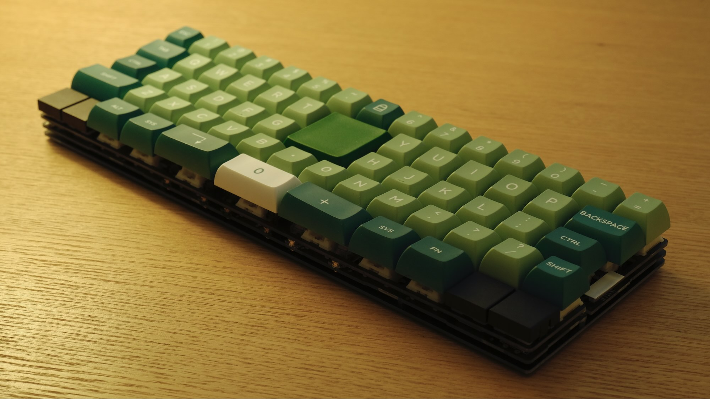
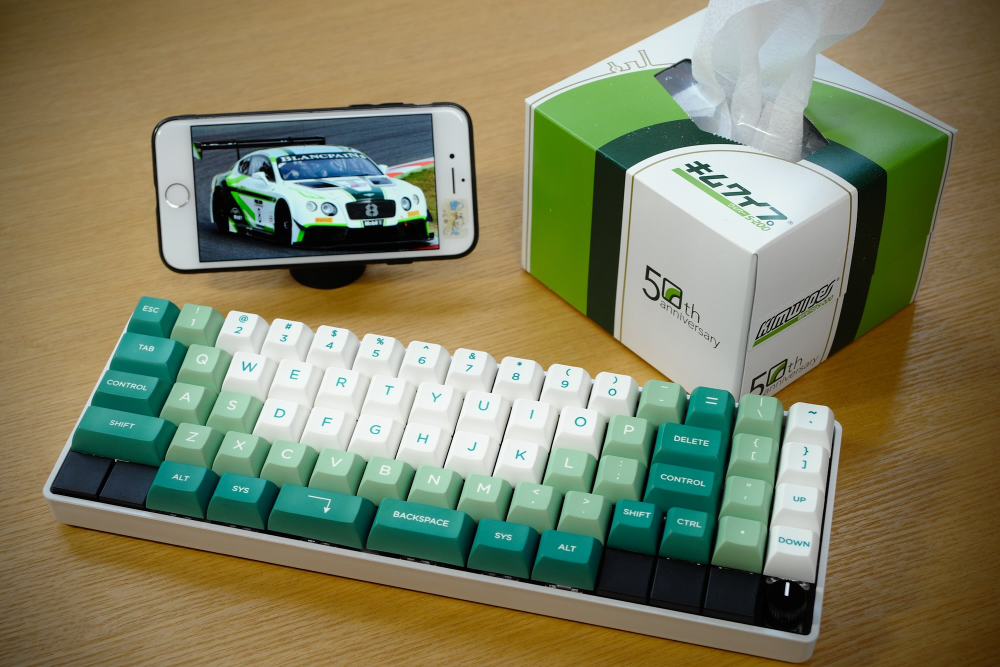
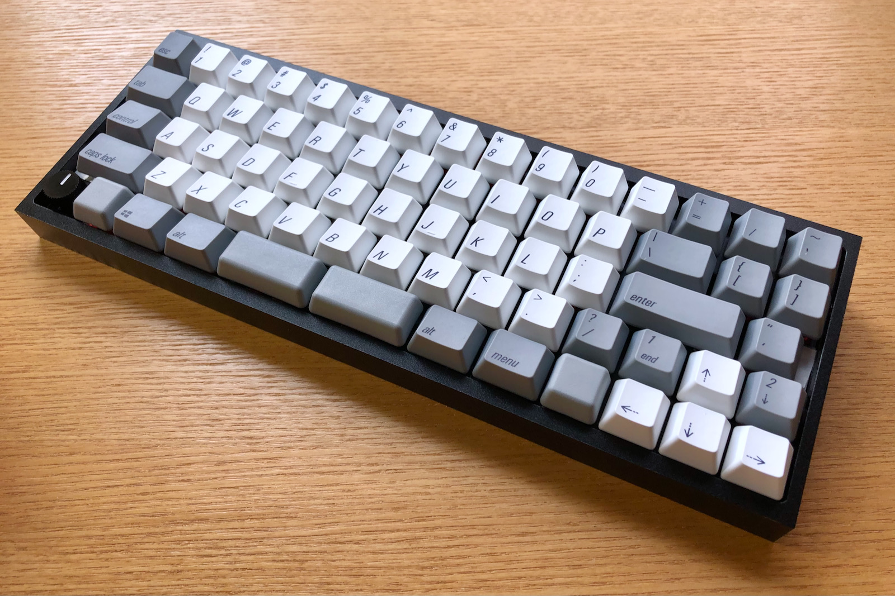
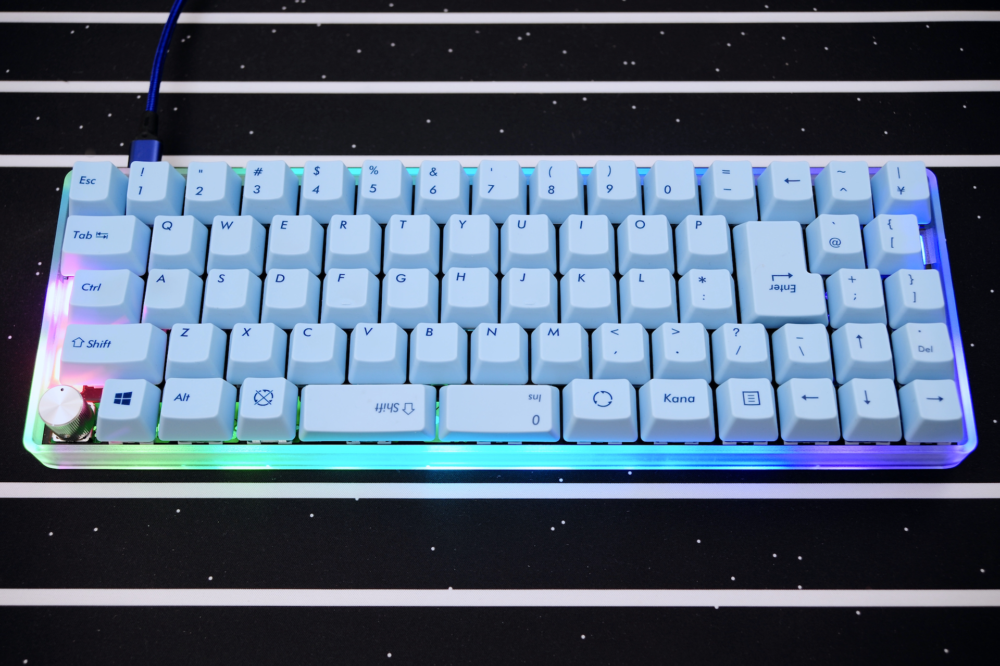

# 試作歴

試作機の履歴をまとめています。

## v.1 (=v.0.4.2)

- 遊舎工房にて委託販売開始。  
  BOOTHでもボトムプレートのセット品を販売。
- SMTA製造でMCUの在庫不足により、ATmega32u4-AUから-MUへ変更。
- ロゴ更新
- シルク調整, 修正
- アンダーグローLEDテープ対応
- Narrowレイアウトで一般的なキーキャップに対応（これにより、すべてのレイアウトで対応）
- Audio用のGPIOピンのメインとサブを入れ替え
- その他

## v.0.4.1

- 試作最終型の予定
- レイアウト調整。最下行から使わないバリエーションを削除。
- 基板とボトムプレートとの接続を調整。
- 外部EEPROMの部品サイズを変更。
- ロゴ追加

  
v.0.4.1
Keycap: KAT Lucky Jade, SP DSA 2*2, PIMP MY KEYBOARD Switch Blocker
Case: Bottom plate kit for Jones

## v.0.4

- 世界的な半導体不足により、MCUをATmega32u4-MUから-AUに変更。
- v.0.2のWideレイアウトを復活させて再編成。
- ケースレス使用できるボトムプレートを試作。
- 総当たりマトリクスを10pinに変更し、外部EEPROMなしでもRemapで4レイヤーまで対応。
- I2C接続の外部EEPROMに対応。
- キープレートと基板を接続する試作→失敗

  
v.0.4  
Keycap: GMK Pulse, PIMP MY KEYBOARD Switch Blocker
Case: KBDfans TOFU 60% Aluminum, Black

## v.0.3.2

- 組み立てやすさを向上。
- ネジ穴経由で導通する不具合対策
- キープレートの切り欠き部分を減らして剛性アップ

  
Jones v.0.3.2  
Keycap: KAT Lucky Jade, PIMP MY KEYBOARD Switch Blocker
Case: 60% Plastic Case, White

## v.0.3.1

- v.0.3の課題や不具合解消。
- オーディオの2音同時発音に対応。
- テープLEDのみ光らせるパターンを追加。

  
v.0.3.1  
Keycap: Qisan / Magicforce PBT 108 keycaps
Case: KBDfans TOFU 60% Aluminum, Black

## v.0.3

- [レイアウト変更](http://www.keyboard-layout-editor.com/#/gists/ab35444150ef1aff63ed32bbe2b9a1ef)  
2U-Wide、Traditionalレイアウトを削除。  
もしかして日本語配列で使いたい人もいたりするの？との思いから、JPスタイルを追加。
- v.0.2の課題や不具合解消。
- キーマトリクスを”総当たりマトリクス”に変更し、MCUのピン使用数を大幅削減（19 → 11）。  
余ったピンを、2個目のロータリーエンコーダ、スピーカー、外部接続、OLED、I2Cなどの機能で使用。
- 左側LED、裏側LEDテープ追加。
- USB Type-C。
- ブロッカー、銘板パーツ廃止。  
[PIMP MY KEYBOARDのSwitch Blocker](https://pimpmykeyboard.com/switch-blocker-pack-of-10/)がブロッカーとして良い出来だったので、今後はこれを使う。

  
Jones v.0.3  
Keycap: FILCO Majestouch 交換用カラーキーキャップセット 日本語108キー・かななし・ミルキーブルー  
Case: 60% Plastic Case, Clear

## v.0.2

- レイアウトの試行錯誤を続け、[2U-Wideレイアウト](http://www.keyboard-layout-editor.com/#/gists/3f5424e6560f5de6fa7c19e22f219831)を追加。  
2U-Wideのホームポジションは肩への負担も減るので気にいっていたが、このレイアウトを覚えると普通のキーボードをまともに打鍵できなくなったため、使用を封印。
- v.0.1の課題や不具合解消
- SMT Assemblyによる製造。  
SMTAに対応するため、部品サイズを変更。

  
Jones v.0.2  
Keycap: Tai-Hao PBT Backlit The Deep Forest Blue 132 Keys SKU#C22BF301  
Case: KBDfans TOFU 60% Aluminum, Silver

## v.0.1

- v.0のレイアウトを元に、[基板に乗せられるレイアウト](http://www.keyboard-layout-editor.com/#/gists/325aaaab8bd5e87bff89b81d67181bea)に調整。  
- ai03氏の[PCB Designer Guide](https://wiki.ai03.com/books/pcb-design/chapter/pcb-designer-guide)を参考に、基板を設計。  
- MCUを乗せた基板の組み立て、動作に成功。

  
Jones v.0.1  
Keycap: Tai-Hao Sakura Michi PBT  
Case: KBDfans TOFU 60% Aluminum, Black

## v.0

試行錯誤の末、2行目と3行目にずれが無いレイアウトが決定。  

KLEで作成したレイアウトを印刷して段ボールに貼り、両面テープでキーキャップを貼り付けたモックアップを作成。  
これをデスクに置いてエアータイプしまくって、違和感なく打鍵できることを確認。

  
Jones v.0 モックアップ

## Before v.0

物理配列について、

- [HHKB](https://happyhackingkb.com/jp/)
- [Treadstoneシリーズ](https://marksard.github.io/2018/12/17/about-treadstone48/)
- [Zinc（シンメトリカル版）](http://www.sho-k.co.uk/tech/735.html)
- [Katana60](http://xahlee.info/kbd/katana60_keyboard.html)

などを参考にしつつ、[Keyboard Layout Editor](http://www.keyboard-layout-editor.com)を使った机上検討を重ね、キーキャップを並べたモックアップをいくつか作成。

1行目と2行目のずれをなくしたものや、[QAZの並びでAを一番外側にしたりしたもの](http://www.keyboard-layout-editor.com/#/gists/f530b44df7799fa4d14944566bb18dd2)を作成するが、いずれも打鍵に不自然さがあったため、ボツ。

  
Jones before v.0 作成したモックアップのひとつ
